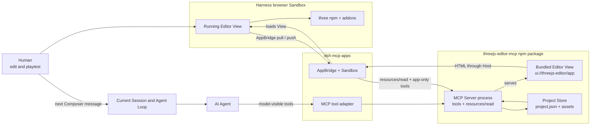
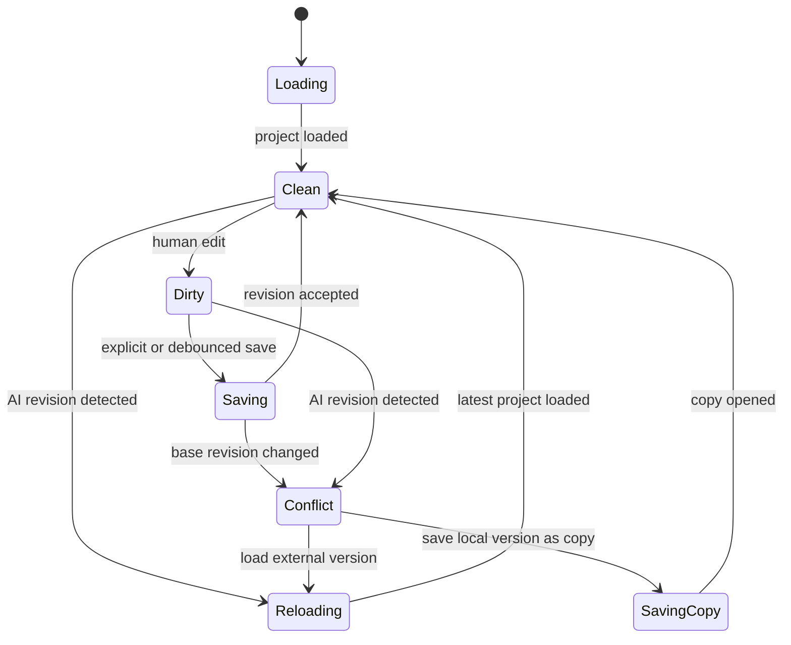
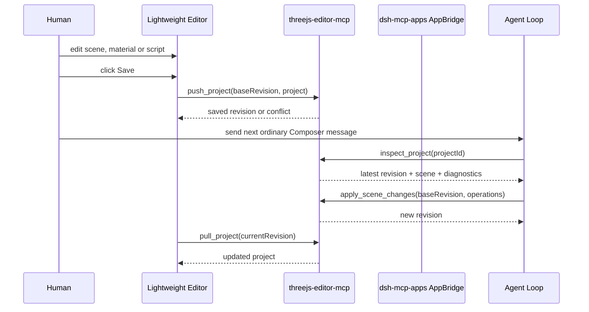

# threejs-editor-mcp 设计方案 / Design Proposal

> Status: M4 implemented; final validation pending approval
>
> Updated: 2026-08-15
>
> Scope: Architecture alignment before implementation

`threejs-editor-mcp` is one standalone MCP Server package for creating, editing, running, and reviewing Three.js mini-games. The package embeds its lightweight Editor as an MCP App View Resource, uses the official `three` npm package, and follows the interaction model of the official Three.js Editor.

## Decision Snapshot / 决策摘要

| Decision | Status | Notes |
|---|---|---|
| Create an independent `threejs-editor-mcp` repository | Confirmed | Requested as a standalone repository |
| Ship the Server and MCP App View in one npm package | Confirmed | One executable package, not two deployed services |
| Depend on the official `three` npm package | Confirmed | Runtime and addons come from npm |
| Build a lightweight editor instead of vendoring the official Editor | Confirmed | Reference its interaction model, not its source tree |
| Keep `deepseek-harness` and Agent Loop unchanged | Confirmed | Post-save handoff uses the existing Session prompt path |
| Store official Three.js scene JSON in a small product envelope | Proposed | Avoid depending on the official Editor's private project format |
| Use revisions and conflict protection instead of CRDT | Proposed | Collaboration is turn-based in V1 |
| Start the next Agent turn only from Harness Composer | Confirmed | App saves never create or queue Agent work |

---

## 中文方案

### 目标

用户可以在 DeepSeek Harness Web 内完成以下工作：

- 让 AI 创建一个可运行的 Three.js 小游戏；
- 在轻量 Editor 中查看层级、选择对象、调整变换和基础材质；
- 编辑游戏脚本并进入 Play 模式；
- 保存人工修改，让 AI 在下一轮读取同一项目继续工作；
- 查看运行错误、截图和项目 revision，判断下一步由人还是 AI 处理。

主链路是：

`自然语言意图 -> MCP 工具修改 -> 轻量 Editor 呈现 -> 人工编辑或运行 -> 保存 -> Composer 普通消息 -> 下一轮 AI 修改`

### 用户可感知约束

- Editor 首版在现有工具行内自适应布局，侧栏在空间不足时折叠为 tabs。
- 拖拽、选择、输入、Play 和 Save 都不会触发模型请求。
- 用户通过现有 Harness Composer 发送下一条普通消息后，AI 才读取最新项目。
- AI 和人不会静默覆盖对方尚未保存的修改。
- 首版不支持人在 AI 当前执行过程中将每次拖拽实时注入同一轮。
- App 失效时，项目仍可通过 MCP tools 读取和修改。

### 事实基线

| Evidence level | Fact | It proves | It does not prove |
|---|---|---|---|
| 官方公开事实 | npm `three` 提供场景、渲染、序列化和 `three/addons` | 核心编辑能力可以建立在官方包上 | 官方包包含完整 Editor 产品 |
| 官方源码 | 官方 Editor 展示了 hierarchy、viewport、inspector、transform、history 和 player 的可行交互 | 可以参考已验证的编辑器交互模型 | 需要复制或 vendoring 官方 Editor |
| 当前代码 | `dsh-mcp-apps` 从 tool `_meta` 取得 `resourceUri`，再向同一个 MCP Server 调用 `resources/read` | MCP App View 可以作为 Server 包内 Resource 分发 | Editor UI 已存在 |
| 当前代码 | `dsh-mcp-apps` 已支持 AppBridge、双 iframe、CSP 和 app-only tool 调用 | 人工操作可以直接保存到 MCP Server | Editor UI 已存在 |
| 当前代码 | `dsh-mcp-apps` 支持动态高度的 `inline` View，当前上限为 800px | 轻量 Editor 可以先复用现有 Host 验证 | 长期编辑体验不需要 fullscreen |
| 当前代码 | Harness Browser Composer 已通过 Session 启动普通用户回合 | 用户可在保存后自然发起下一轮 | 无需修改 Agent Loop |
| 当前代码 | MCP App 的 app-only tool 调用直接经过 Host 到 MCP Server | 人工保存不需要经过 Agent Loop | 人工修改会自动进入模型上下文 |

M0 必须用真实 Browser E2E 验证 WebGL、Sandbox、输入事件和保存链路。类型检查或 iframe 能打开不能证明场景非空、TransformControls 可用或 Play 正常。

### 范围

#### V1 包含

- 独立 npm 包和 stdio MCP Server；
- 官方 `three` npm 包和按需使用的 `three/addons`；
- 产品自有的轻量 Editor；
- `empty` 和 `pong` 两个自有模板；
- 层级、Viewport、对象选择、变换、基础材质和单脚本编辑；
- 本地 undo/redo、保存、Play 和运行诊断；
- 项目列表、创建、打开、检查和批量修改；
- revision 检查和冲突保护；
- 用户通过 Harness Composer 发起同一 Session 的下一轮 Agent；
- 适配现有工具行宽高的 responsive inline Editor；
- 真实 Harness Web E2E、运行日志和 WebGL 像素验证。

#### V1 不包含

- 官方 Editor 源码、PWA、菜单系统和 IndexedDB 持久化；
- CRDT、OT 或多人实时编辑；
- 人工操作向当前执行中的 Agent 实时 steering；
- MCP App fullscreen display mode；
- 通用 IDE、npm 依赖编辑和任意构建系统；
- 大型 GLTF、视频和纹理资产管理；
- 后处理、节点材质、WebGPU 和路径追踪；
- Agent 自动判断视觉质量已经达到产品标准。

### 总体架构



### 部署与运行边界

`MCP App 在 MCP Server 里`描述的是分发和所有权；`MCP App 在浏览器运行`描述的是运行位置。两者同时成立。

| Object | Package ownership | Runtime location |
|---|---|---|
| MCP Server executable | `threejs-editor-mcp` npm package | Host-launched stdio process |
| Editor View HTML | Same npm package, registered as `ui://threejs-editor/app` | Static Resource returned by `resources/read` |
| Running Editor View | Bytes originate from the same Server Resource | Different-origin Harness browser Sandbox |

There is no independent Editor web service, deployment, port or release artifact. Building the npm package compiles the View into the Server package; starting the MCP Server makes both tools and the View Resource available.

### 人工操作与 Agent Loop

人工编辑和 AI 执行属于两个不同阶段。

| Action | Path | Enters Agent Loop? | Result |
|---|---|---:|---|
| Drag an object or edit a material | Human -> MCP App local state | No | Editor becomes dirty |
| Save the project | MCP App -> app-only `push_project` -> MCP Server | No | A new project revision is persisted |
| Send the next Composer message | Human -> Harness Composer -> current Session | Yes, as a normal new user turn | Agent reads the saved revision |
| AI changes the project | Agent -> model-visible MCP tool -> MCP Server | Already inside the current turn | A new revision is persisted |

No Agent Loop implementation change is required. V1 deliberately avoids injecting human operations into an in-flight turn. Save only persists a revision. A later ordinary Composer message starts the next turn and the Agent reads that saved revision.

### 责任边界

| Owner | Responsibilities | Explicit exclusions |
|---|---|---|
| `threejs-editor-mcp` Server process | Tools, View Resource, project storage, revision checks, scene operations and validation | Harness Session lifecycle |
| `threejs-editor-mcp` View code | Bundled in the same package; lightweight editor, local history, Play and sync state | Independent deployment or direct Session access |
| `dsh-mcp-apps` | Existing MCP transport, visibility authorization and View isolation | Three.js project semantics |
| DeepSeek Harness | Existing Session and Agent Loop | Product-specific Editor code |
| Human | Visual editing, playtest, conflict choice and explicit Save | Manual JSON editing as a required path |
| AI Agent | Inspect project, apply changes and judge diagnostics | Silent replacement of dirty human state |

### 项目模型

Each Server instance receives one configured root:

```text
<root>/
└── <project-id>/
    ├── project.json
    └── assets/
```

`project.json` is a small versioned envelope:

```json
{
  "schemaVersion": 1,
  "title": "Pong",
  "scene": {},
  "camera": {},
  "renderer": {},
  "script": {
    "source": ""
  }
}
```

`scene` and `camera` use the official `Object3D.toJSON()` representation and load through `ObjectLoader`. The envelope only adds game title, renderer settings and one script source. It does not depend on the official Editor's project schema.

The project revision is the SHA-256 digest of canonical `project.json` bytes. Every mutation accepts `baseRevision`, serializes writes per project, rechecks the digest and commits with temporary-file rename.

Project IDs are relative identifiers. The Server rejects absolute paths, `..`, NUL bytes, symlink escape and any resolved path outside `--root`.

### 轻量 Editor

The Editor uses TypeScript, DOM and CSS without a UI framework in V1. Three.js objects remain the state model, so introducing a second component state tree is unnecessary.

| Surface | V1 capability | Official package |
|---|---|---|
| Toolbar | Select, move, rotate, scale, undo, redo, save and Play | `TransformControls` |
| Hierarchy | Scene tree, selection and basic reparenting | `Object3D` |
| Viewport | Grid, camera orbit, raycast selection and resize | `WebGLRenderer`, `OrbitControls`, `Raycaster` |
| Inspector | Name, visibility, transform and basic material fields | Core object and material APIs |
| Script | One JavaScript source editor and runtime errors | Native textarea in V1 |
| Player | `start`, `update`, `dispose`, keyboard and pointer input | `Clock` and renderer loop |

The official Editor is used as an interaction reference:

- hierarchy on the left;
- viewport and transform gizmo in the center;
- object, material and script inspector on the right;
- explicit edit and Play modes;
- command-based local undo/redo.

V1 implements only commands required by visible controls. It does not reproduce the official Editor's generalized command catalog, menus, loaders, exporters or plugin system.

The game script follows one small lifecycle contract: `start(context)`, `update(context, delta)` and `dispose(context)`. It executes inside the existing MCP App Sandbox and receives Three.js, scene, camera, renderer and input through `context`. External imports are not supported in V1.

### Editor 同步状态



The Editor never force-overwrites a conflict. A dirty project can load the external revision or save its local state as a new project copy. V1 does not attempt structural merging.

### MCP 工具

#### Model-visible tools

| Tool | Purpose | Main result |
|---|---|---|
| `list_projects` | Discover projects under `--root` | IDs, titles and revisions |
| `create_project` | Create `empty` or `pong` | Project summary and linked Editor View |
| `open_editor` | Open an existing project | Project summary and linked Editor View |
| `inspect_project` | Read a compact scene and script summary | Hierarchy, transforms, materials, script and diagnostics |
| `apply_scene_changes` | Apply one atomic batch of domain operations | New revision and change summary |
| `check_project` | Validate JSON, references, script syntax and recorded runtime errors | Errors, warnings and evidence timestamps |

`apply_scene_changes` supports the operations needed by V1 controls: add, update, move and remove objects; update transform and visibility; create primitive geometry, camera and light objects; update basic materials; replace the game script; and update project settings.

The model does not return complete project JSON. One batch creates one revision and one Editor reload.

#### App-only tools

| Tool | Purpose |
|---|---|
| `pull_project` | Return the complete project only when the App revision is stale |
| `push_project` | Save one Editor snapshot using compare-revision |
| `report_diagnostics` | Record Play errors, warnings and tested revision |

Only `create_project` and `open_editor` link to `ui://threejs-editor/app`. The Host reads that Resource from the same MCP Server. Mutation tools do not mount duplicate Editors in the conversation.

### 人机协作时序



The saved project is the handoff artifact. The App-generated user message expresses intent and project identity; it does not contain scene JSON or replay every human action.

### MCP Apps Host 关系

V1 uses the existing inline View, AppBridge, Sandbox, app-only tools and dynamic height up to the current 800px limit. M0 found one generic Sandbox bug: the outer card resized, but the nested iframe remained at its browser-default height because the wrapper used `min-height: 100%`. `dsh-mcp-apps` therefore needs the one-line `html, body { height: 100% }` fix. This changes no MCP Apps capability or Three.js-specific behavior.

The M0 bundle is 862,453 bytes, above the Host's default 512 KiB Resource limit. Deployment explicitly sets the existing `maxBodyBytes` option to 2 MiB; the Host still enforces a finite bound. The inline layout keeps the Viewport primary and collapses hierarchy, Inspector and script surfaces into tabs when width is insufficient. Generic fullscreen remains a separate proposal only if later Editor E2E shows the core workflow cannot fit.

`fullscreen`, `ui/message`, `ui/update-model-context`, sampling, app-provided tools, arbitrary link opening and device permissions remain deferred.

M0 evidence and commands are recorded in [`reports/M0-validation.md`](reports/M0-validation.md).

### 安全约束

- The lightweight Editor and game script execute only inside the different-origin double iframe.
- The View receives an opaque `viewId`, never an MCP server selector or filesystem root.
- Model-visible and app-only tools remain separated by `_meta.ui.visibility`.
- The Server confines all filesystem access to `--root`.
- Project writes are size-bounded, revision-checked and atomic.
- V1 game scripts receive a bounded runtime context and cannot import arbitrary modules.
- External resource domains are denied by default.
- App edits, Play, diagnostics and Save cannot start, steer or enqueue Agent work.

### 诊断与证据

| Evidence | Producer | Consumer | Conclusion boundary |
|---|---|---|---|
| Project parser and reference errors | MCP Server | AI and human | The stored structure is loadable |
| Script syntax errors | MCP Server and App | AI and human | The script parses under the tested runtime contract |
| Player console and runtime errors | MCP App | MCP Server, then AI | The tested revision ran without those observed errors |
| WebGL canvas pixel check | Browser E2E | Release gate | The viewport rendered non-background pixels at tested dimensions |
| Screenshot or GIF | Browser E2E | Human reviewer | The captured state is visually inspectable |
| Human playtest result | Human through the next Composer message | AI | The reported interaction path was manually exercised |

No single source proves game quality. M0 and release validation combine logs, pixels, screenshots and interaction assertions.

### 建议目录

```text
threejs-editor-mcp/
├── src/
│   ├── server/
│   ├── projects/
│   ├── tools/
│   └── app/
│       ├── editor/
│       └── player/
├── templates/
├── tests/
├── DESIGN.md
├── package.json
└── LICENSE
```

### 里程碑

| Milestone | Work | Exit criteria |
|---|---|---|
| M0: npm 与 Sandbox 验证 | Bundle official `three`, render a movable cube and run Pong in the real Sandbox | Harness Web E2E shows nonblank moving pixels, working keyboard input, correct resize and no unexpected console errors |
| M1: Server 与 View 基础 | Register tools and `ui://threejs-editor/app` in one package; add project create/open/pull/push | Existing `dsh-mcp-apps` loads the inline View and saves a project without additional Host changes |
| M2: Editor MVP | Add project store, hierarchy, viewport, selection, transform, inspector, history and save | Human edits survive reload; AI clean updates reload; dirty conflicts preserve both versions |
| M3: 游戏协作 | Add script lifecycle, Play, diagnostics, Composer handoff and model scene operations | Human saves; the next Composer turn reads that revision and the Editor displays the next revision |
| M4: 资产与发布 | Add bounded GLTF/texture support, export, package hardening, CI and npm release | Packaged install works through `dsh plugin`; Browser and security gates pass |

### 验收标准

- A fresh install creates `empty` and `pong` projects without modifying Harness product source.
- One npm package provides the MCP executable, tools and `ui://threejs-editor/app`; no Editor web service is deployed.
- Runtime code comes from the official `three` npm dependency; no official Editor source is vendored.
- The Editor is usable inside the existing inline View at the tested Harness dimensions.
- Hierarchy selection, viewport picking, move/rotate/scale and basic material edits work.
- Pong renders nonblank pixels and responds to keyboard input in Play mode.
- Human edits persist to `project.json` and survive Browser reload.
- Save emits no Agent work; the next ordinary Composer message starts the next turn.
- The next Agent turn inspects the latest revision and operation records.
- AI can modify the same project through bounded domain operations.
- A stale save cannot overwrite a newer revision.
- A dirty Editor exposes safe conflict actions instead of automatic reload.
- App-only tools remain absent from model tool schemas and bound to their MCP server.
- Rejected origin, path, size and revision cases fail without data loss.
- Browser E2E verifies CSP, origins, API calls, WebGL pixels, controls, teardown and console output.

### 风险与待验证项

| Risk | Current response | Decision point |
|---|---|---|
| Building an Editor grows into copying the official product | Freeze the V1 surface table and implement only visible controls | Add a feature only after a concrete game requires it |
| The Three.js App bundle exceeds the default 512 KiB View limit | M0 measured 862,453 bytes and validated a 2 MiB `maxBodyBytes` bound | Design multi-resource loading only if the release bundle approaches that bound |
| The product envelope diverges from Three.js serialization | Keep scene and camera as native `toJSON()` output with `schemaVersion` around them | Add migrations only when schema 2 exists |
| The script lifecycle becomes a custom framework | Keep only `start`, `update` and `dispose` with one context object | Add events only when Pong cannot be expressed |
| Human and AI modify concurrently | Compare-revision and save-copy conflict path | Consider operation logs only after measured frequent conflicts |
| The inline Editor is too cramped | Keep the Viewport primary and collapse secondary panels into tabs | Propose generic fullscreen only if Browser E2E cannot satisfy the edit-and-Play path |
| Model cannot inspect visual quality | Provide structured scene and runtime diagnostics; keep human as visual judge | Add model-visible capture only when the selected model supports images |

### 待确认

Implementation starts only after review confirms:

1. V1 builds a product-owned lightweight Editor from `three` npm and selected addons.
2. `project.json` wraps native Three.js scene/camera JSON and one game script.
3. Human edits save outside Agent Loop; only a later Harness Composer message starts the next ordinary turn.
4. `dsh-mcp-apps` provides the M0-proven Sandbox height fix; fullscreen and App-originated messages remain deferred.
5. V1 is limited to `empty`, `pong`, primitives and small local assets.

---

## English Summary

### Product contract

`threejs-editor-mcp` is one independent npm package and one MCP Server process. The same package embeds `ui://threejs-editor/app`; the Host obtains that HTML with `resources/read` and runs it inside the browser Sandbox. There is no separate Editor service or deployment.

The package depends on the official `three` npm package and selected addons. Its View is a product-owned lightweight editor inspired by the official Three.js Editor; no Editor source is vendored.

V1 provides hierarchy, viewport, selection, transform controls, basic material inspection, one game script, local undo/redo, Play and diagnostics.

### Agent Loop boundary

Human editing does not enter the Agent Loop. The App saves through app-only MCP tools, producing a new project revision. Only a later ordinary message sent by the user through the Harness Composer starts the next Agent turn. The Agent reads the latest revision through model-visible MCP tools.

No Agent Loop implementation change is required. Real-time injection of each human operation into an active turn is explicitly out of scope. Save is the durable handoff boundary, while Composer remains the explicit Agent-turn boundary.

### Project and concurrency

`project.json` is a small versioned envelope around native `Object3D.toJSON()` scene and camera data, renderer settings and one script source. Its SHA-256 digest is the revision. Writes compare the base revision and commit atomically. Dirty local state is never silently replaced.

### Host interaction

V1 uses the existing `dsh-mcp-apps` inline View and 800px height limit after one generic nested-iframe height fix proven by M0. A 2 MiB `maxBodyBytes` deployment bound accommodates the offline View. The Editor prioritizes its Viewport and collapses secondary panels responsively. Fullscreen, App-originated messages and model-context injection remain deferred.

### Delivery order

M0 proves the official npm runtime inside the real Sandbox. M1 establishes the Server, View Resource and project flow on the existing Host. M2 builds the minimal editor. M3 completes script Play and turn-based human/AI collaboration. M4 adds bounded assets and release hardening.

## References

- [Three.js npm package](https://www.npmjs.com/package/three)
- [Three.js Object3D.toJSON](https://threejs.org/docs/#api/en/core/Object3D.toJSON)
- [Three.js ObjectLoader](https://threejs.org/docs/#api/en/loaders/ObjectLoader)
- [Three.js TransformControls addon](https://threejs.org/docs/#examples/en/controls/TransformControls)
- [Official Three.js Editor interaction reference](https://threejs.org/editor/)
- [Official Three.js Editor source reference](https://github.com/mrdoob/three.js/tree/dev/editor)
- [MCP Apps stable specification 2026-01-26](https://github.com/modelcontextprotocol/ext-apps/blob/main/specification/2026-01-26/apps.mdx)
- [Current dsh-mcp-apps package](../dsh-mcp-apps/README.md)
