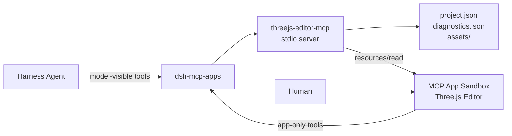

# threejs-editor-mcp

English | [简体中文](README.zh-CN.md)

Create, edit, run, and inspect small Three.js games inside a DeepSeek Harness
chat card. One npm package provides the stdio MCP Server, model tools, app-only
tools, and the bundled `ui://threejs-editor/app` MCP App.


## Architecture



The Editor uses the official `three` npm package. It is a product-owned,
lightweight editor inspired by the official Three.js Editor; no Editor source
is vendored and no separate web service is required.

## Install and Run with npm

Install the MCP Apps Host and this MCP Server:

```sh
dsh plugin --profile web add @creative-dswork/dsh-mcp-apps
npm install --global threejs-editor-mcp@0.1.0
threejs-editor-mcp --root /absolute/path/to/threejs-projects
```

Or run the Server without a global install:

```sh
npx --yes threejs-editor-mcp@0.1.0 --root /absolute/path/to/threejs-projects
```

For a global install, configure the `mcp-apps` row in
`~/.dsh/profiles/web/cordis.patch.yml` (or
`$DSH_HOME/profiles/web/cordis.patch.yml` when set) and replace the initial
`[]`:

```yaml
- id: mcp-apps
  config:
    maxBodyBytes: 2097152
    servers:
      - serverName: threejs
        transport: stdio
        command: threejs-editor-mcp
        forwardWorkspace: true
        args:
          - --root
          - /absolute/path/to/threejs-projects
```

To let npm resolve the package directly, use `npx` in the same configuration:

```yaml
- id: mcp-apps
  config:
    maxBodyBytes: 2097152
    servers:
      - serverName: threejs
        transport: stdio
        command: npx
        forwardWorkspace: true
        args:
          - --yes
          - threejs-editor-mcp@0.1.0
          - --root
          - /absolute/path/to/threejs-projects
```

The root can also be provided with `THREEJS_EDITOR_PROJECT_ROOT`. It stores
managed projects and is not the local game directory selected in DSH Web.

Start DSH Web, add the existing Three.js project as the current Workspace, and
ask the Agent to open the current project. The Editor opens that directory in
place; no path is passed as a model tool argument. See
[User Operations](docs/USER-OPERATIONS.md) for the development workflow and
security boundaries.

## Capabilities

- `empty` and playable `pong` project templates;
- hierarchy, viewport picking, transform controls, Inspector, undo/redo;
- one `start` / `update` / `dispose` game script with keyboard and pointer input;
- revision-checked human saves and model changes;
- revision-bound Play diagnostics;
- GLB, PNG, and JPEG import plus self-contained project export;
- clean reload and dirty conflict preservation.

Model-visible tools:

`list_projects`, `create_project`, `open_editor`, `inspect_project`,
`apply_scene_changes`, and `check_project`.

App-only tools:

`pull_project`, `push_project`, `save_project_copy`, `report_diagnostics`,
`put_asset`, and `export_project`.

## Asset Limits

Assets are local only. Each file is limited to 256 KiB, each project to eight
files and 512 KiB total. The Server validates names, MIME types, signatures,
GLB 2.0 headers, and rejects external GLB resource URIs. Supported extensions
are `.glb`, `.png`, `.jpg`, and `.jpeg`.

The JSON export contains the saved project, exact revision, and base64 copies
of its original assets. The MCP Apps Host mediates the download because direct
downloads are blocked inside the Sandbox.

## Development

Requires Node.js 22.19 or newer and pnpm 10.25.

```sh
pnpm install
pnpm run check
pnpm run test:pack
```

Run the server directly:

```sh
pnpm run build
node dist/server.js --root .tmp/projects
```

The complete design and phased evidence are in [DESIGN.md](docs/DESIGN.md) and
[`reports/`](reports/).

## Security

Projects and assets are confined to the configured root. Project writes are
size-bounded, revision-checked, serialized per project, and committed with
temporary-file rename. Project paths, asset paths, symlinks, stale revisions,
oversized payloads, mismatched file types, and external asset URLs are rejected.
Game scripts run only in the existing different-origin double iframe Sandbox.

## License

MIT
