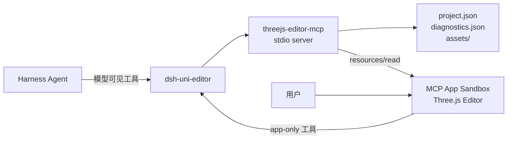

# threejs-editor-mcp

[English](README.md) | 简体中文

在 DeepSeek Harness 的对话卡片中创建、编辑、运行和检查小型 Three.js 游戏。一个 npm 包包含 stdio MCP Server、模型工具、app-only 工具，以及打包后的 `ui://threejs-editor/app` MCP App。


## 架构



编辑器使用官方 `three` npm 包。它是项目自带的轻量编辑器，交互参考官方 Three.js Editor；项目没有复制官方 Editor 源码，也不需要单独部署 Web 服务。

## 使用 npm 安装和运行

安装 MCP Apps Host 和本 MCP Server：

```sh
dsh plugin --profile web add @creative-dswork/dsh-uni-editor
npm install --global threejs-editor-mcp@0.1.0
threejs-editor-mcp --root /absolute/path/to/threejs-projects
```

也可以不进行全局安装，直接运行 Server：

```sh
npx --yes threejs-editor-mcp@0.1.0 --root /absolute/path/to/threejs-projects
```

全局安装后，编辑
`~/.dsh/profiles/web/cordis.patch.yml`；如果设置了 `DSH_HOME`，则编辑
`$DSH_HOME/profiles/web/cordis.patch.yml`。将初始的 `[]` 替换为：

```yaml
- id: mcp-apps
  config:
    maxBodyBytes: 2097152
    servers:
      - serverName: threejs
        transport: stdio
        command: threejs-editor-mcp
        forwardWorkspace: true
        args:
          - --root
          - /absolute/path/to/threejs-projects
```

也可以在同一配置中使用 `npx`，由 npm 直接解析软件包：

```yaml
- id: mcp-apps
  config:
    maxBodyBytes: 2097152
    servers:
      - serverName: threejs
        transport: stdio
        command: npx
        forwardWorkspace: true
        args:
          - --yes
          - threejs-editor-mcp@0.1.0
          - --root
          - /absolute/path/to/threejs-projects
```

也可以通过 `THREEJS_EDITOR_PROJECT_ROOT` 设置 Managed Project 的存储根目录。
它不是用户在 DSH Web 中选择的本地游戏目录。

启动 DSH Web 后，将已有 Three.js 工程添加为当前 Workspace，再让 Agent
“打开当前工程”。Editor 会原地打开该目录，模型工具参数中不包含绝对路径。
开发流程和安全边界见[用户操作](docs/USER-OPERATIONS.md)。

## 能力

- 提供 `empty` 和可直接游玩的 `pong` 项目模板；
- 支持层级树、Viewport 拾取、变换控件、Inspector 和撤销/重做；
- 支持一个包含 `start`、`update` 和 `dispose` 生命周期的游戏脚本，并接收键盘和指针输入；
- 人工保存和模型修改都检查 revision；
- Play 诊断与对应 revision 绑定；
- 支持导入 GLB、PNG 和 JPEG，以及导出自包含项目；
- 重载干净状态，发生冲突时保留未保存修改。

模型可见工具：

`list_projects`、`create_project`、`open_editor`、`inspect_project`、`apply_scene_changes` 和 `check_project`。

app-only 工具：

`pull_project`、`push_project`、`save_project_copy`、`report_diagnostics`、`put_asset` 和 `export_project`。

## 资源限制

所有资源只保存在本地。单个文件最大 256 KiB；每个项目最多保存八个文件，总大小不超过 512 KiB。Server 会校验文件名、MIME 类型、文件签名和 GLB 2.0 header，并拒绝引用外部资源 URI 的 GLB。支持的扩展名为 `.glb`、`.png`、`.jpg` 和 `.jpeg`。

JSON 导出文件包含保存后的项目、准确 revision，以及原始资源的 base64 副本。Sandbox 会阻止直接下载，因此 MCP Apps Host 负责代理下载。

## 开发

需要 Node.js 22.19 或更高版本，以及 pnpm 10.25。

```sh
pnpm install
pnpm run check
pnpm run test:pack
```

直接运行 Server：

```sh
pnpm run build
node dist/server.js --root .tmp/projects
```

完整设计和各阶段验证记录位于 [DESIGN.md](docs/DESIGN.md) 与 [`reports/`](reports/)。

## 安全

Server 将项目和资源限制在配置的根目录内。项目写入有大小上限和 revision 检查；同一项目的写入会串行执行，并通过临时文件 rename 提交。Server 会拒绝非法项目路径、资源路径、symlink、过期 revision、超大 payload、文件类型不匹配和外部资源 URL。游戏脚本只在现有的不同源双层 iframe Sandbox 中运行。

## 许可证

MIT
