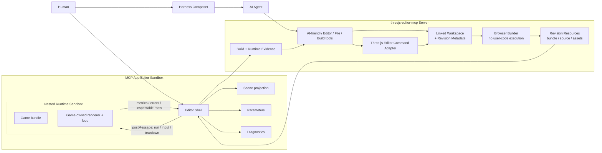

# Three.js Collaborative Game Studio V2 可执行规划

状态：**M6 与 M6.1 已完成验证并获批准；M7-M11 继续执行阶段确认门禁**
基线：`threejs-editor-mcp@0.1.0`，现有 M0-M4 已完成
外部测试语料：`Threejs-Awesome-Graphics-Agent-Skills@0.8.0`，固定 commit
[`98453747`](https://github.com/scottstts/Threejs-Awesome-Graphics-Agent-Skills/tree/98453747cc0678f6a5d910f38d7483596a5f9a40)

## 决策摘要

这个阶段不再把现有轻量 Editor 横向扩成更多 `Object3D` 表单，而是增加
**Workspace 模式**：

- 本地 Three.js 工程目录是首要入口，用户显式授权后原地打开，源码文件仍是
  人和 AI 协作的真值；
- Managed Workspace 只用于复制导入不可信项目或创建新项目；
- 不可变 project revision 同时覆盖源码、配置和资产；
- Server 只构建源码，不执行游戏代码；
- 游戏在 Editor 内部的独立 Runtime Sandbox 中执行，并拥有自己的 renderer、
  render loop、DOM 输入和 GPU 资源；
- Human UI 以 Canvas、Scene、Parameters 和 Diagnostics 为主，不提供源码编辑器；
- AI 通过文件 MCP tools 修改 Workspace，源码仍参与同一 revision；
- 编辑能力优先复用 Three.js 官方 npm 模块和官方 Editor 的场景模型、Command、
  History、Loader/Exporter 语义，再通过 AI 友好的 MCP tools 暴露；
- 现有 Scene 模式、Pong、MCP tools 和 Agent Loop 边界继续兼容；
- 外部图形案例作为固定版本的兼容性语料运行，不复制进 npm 包。

“支持任意复杂度”在本方案中的可验收含义是：项目不再受“一个序列化 Scene +
一段脚本”的表达能力限制；任意规模的模块图可以被保真保存和代码编辑，支持的
runtime profile 可以构建和运行。它不等于没有磁盘、内存、GPU、浏览器和依赖
安全边界，也不等于所有第三方引擎对象都能自动映射成可视化 Inspector。

## 产品愿景

用户始终在同一个 Harness Chat 中完成游戏制作：

```text
AI 创建或修改源码
→ Chat 卡片加载同一 project revision
→ 人在 Editor 中调整 Scene、参数或资产
→ 人运行并保存
→ 运行证据绑定该 revision
→ 人通过 Composer 发出下一条自然语言消息
→ AI 读取源码、构建诊断和运行证据
→ AI 原子修改同一个项目
→ Editor 加载新 revision 并再次验证
```

人工编辑、Play、保存和采集诊断继续不进入 Agent Loop。只有 Harness Composer
中的普通用户消息创建下一轮 Agent。

## 用户可感知契约

| 场景 | 用户看到的行为 | 系统保证 |
|---|---|---|
| AI 修改 | 当前卡片在 clean 状态加载新 revision | 不生成第二张 Editor 卡片 |
| 人工编辑 | Scene 和 Parameters 进入同一 dirty 状态 | 保存时只产生一个原子 revision |
| Play | 游戏在隔离 Runtime 中启动 | 未保存 revision 不可作为正式诊断基线 |
| Stop / Reload | Runtime 完整 teardown 后重建 | 旧循环、监听器和 GPU 资源不能继续工作 |
| 并发修改 | dirty 状态出现冲突选择 | 不静默覆盖人工或 AI 修改 |
| 构建失败 | 错误指向源码文件和行列 | 失败产物不能进入 Runtime |
| 复杂项目 | 可以完整保留和编辑模块、shader 与资产 | 可视化编辑仅覆盖 runtime 暴露的对象和参数 |
| 本地项目 | 用户注册目录后在原位置打开 | AI 只能访问注册目录，不能自行选择任意本地路径 |

## 现状与直接缺口

| 当前事实 | 直接证据 | 能证明 | 不能证明 / 直接缺口 |
|---|---|---|---|
| 项目由 Scene JSON、Camera JSON 和单脚本组成 | [`src/projects.ts`](../src/projects.ts) | 基础场景可稳定序列化 | 模块图、自定义 renderer、shader 文件和构建配置可表达 |
| App 固定创建一个 `WebGLRenderer` 并统一调用 `renderer.render` | [`src/view.ts`](../src/view.ts) | Pong 和普通 Scene 可运行 | multipass、EffectComposer、WebGPU、raw WebGPU 或 runtime 自有循环可运行 |
| 脚本通过 `Function('THREE', source)` 编译 | [`src/view.ts`](../src/view.ts) | 单文件 lifecycle 可运行 | ESM import、source map、worker 和第三方依赖可运行 |
| 资产仅支持小型 GLB/PNG/JPEG | [`src/projects.ts`](../src/projects.ts) | M4 的小资产链路安全 | KTX2、HDR/EXR、音频、大型 GLB、二进制 volume 和项目目录可承载 |
| AI 只能使用有限 scene operations | [`src/server.ts`](../src/server.ts) | AI 可安全修改 Pong 类场景 | AI 可编辑任意源码、GLSL/TSL/WGSL 和多文件配置 |
| npm `three` 导出 core、addons、WebGPU、TSL 和 src，但不导出 `editor/js` | `three@0.185.1` package exports | 官方 renderer、controls、loaders/exporters 可直接依赖 | Editor Command/History 不是稳定 npm export，不能直接依赖 |
| 官方 r185 Editor 有场景模型、History、Loader、Player 和 24 类可序列化 Command | [官方 Editor r185](https://github.com/mrdoob/three.js/tree/r185/editor/js) | 有成熟编辑语义可复用 | 完整官方 UI 能无改造嵌入 Chat 卡片 |
| App SDK 支持 `readServerResource()` | `@modelcontextprotocol/ext-apps@1.7.5` | App 可经 Host 读取同 Server Resource | 大资源、缓存和 revision 绑定已实现 |
| `dsh-mcp-apps` 已代理 App 的 `resources/read` | [`dsh-mcp-apps/src/host.ts`](../../dsh-mcp-apps/src/host.ts) | 不必增加独立 Editor Web 服务 | 嵌套 Runtime Sandbox 和大资源门禁已验证 |

结论：主要瓶颈是本地项目接入、revision、runtime ownership 和 MCP 映射，不是
重新实现 Three.js 已经具备的编辑语义。

## 兼容性分级

复杂度按机制分级，不按代码行数或视觉效果分级。

| 等级 | 能力 | 验收边界 |
|---|---|---|
| C0 保真编辑 | 保存、读取、搜索、修改和导出任意文本/二进制项目文件 | 不保证项目可构建 |
| C1 标准运行 | ESM/TypeScript、多文件、`three`、`three/addons`、WebGL2、常用资产 | 构建、运行、输入和 source map 通过 |
| C2 高级 WebGL | ShaderMaterial、MRT、render target、post-processing、temporal state | runtime 自有 render/resize/dispose 通过 |
| C3 WebGPU/TSL | `three/webgpu`、`three/tsl`、compute/storage、异步 render | 能力探测、运行、诊断和降级明确 |
| C4 生态项目 | 受控第三方依赖、GLTF 动画、压缩资产、physics/audio/worker | 每个 dependency profile 有独立兼容证据 |
| C5 原始后端 | raw WebGPU/WGSL 或完全自定义 canvas runtime | 代码可编辑；可视化 Scene 投影允许为空 |

V2 的核心保证是 C0-C3；`0.2.0` 只承诺 G1 已验证的 C4 dependency profile，
不宣称覆盖整个 npm 生态。C5 作为边界案例，不阻塞首个 V2 版本。

## 外部测试语料

### 选择原则

测试案例必须增加新的系统机制覆盖，而不是只增加画面种类。每个案例都要：

- 固定随机种子、viewport、DPR、时间和质量档位；
- 暴露 debug mode 和可读 metrics；
- 提供无 post-processing 或机制隔离基线；
- 定义一次人工修改和一次 AI 修改；
- 记录 source revision、build revision、run ID 和诊断；
- 验证 teardown 后没有旧 Runtime 继续输出。

### 案例矩阵

| ID | 案例 | 主要机制 | 协作测试 | 目标阶段 |
|---|---|---|---|---|
| P0 | 自有 Pong | 多文件基础游戏、键盘、Scene 投影 | 人改球速，AI 改碰撞逻辑 | M6 |
| P1 | Formula One Race Car | WebGPU/TSL、复杂程序几何、语义层级、运行 metrics | 人切换 livery，AI 修改可命名几何参数 | M7 |
| P2 | Touch-History Frost | pointer、half-float ping-pong、resize/reset、temporal state | 人调 decay，AI 修复 resize 后 history | M8 |
| P3 | Interactive Pool Volume | 多 render target、水波模拟、拖拽、caustics | 人拖球验证，AI 修改 wave/damping 参数 | M8 |
| P4 | Spectral Cascade Ocean | 多模块 FFT、GPU IFFT、debug render、确定性校验 | 人改风场，AI 修复 shader/build 错误 | M9 |
| P5 | Weather Volume Clouds | EffectComposer、3D textures、EXR/bin 资产、质量档位 | 人降质量，AI 修改 density/lighting | M9 |
| P6 | Volumetric Fluid Fire | WebGPU compute/storage、TSL、GLTF+Draco、Bloom | 人调 emitter，AI 修改 compute 参数 | M10 |
| P7 | GPU-Culled Flower Field | raw WebGPU/WGSL、indirect draw、GPU metrics | 只验证 C5 边界，不作为 V2 阻塞项 | M10 Stretch |
| G1 | 自有 Gameplay Systems Fixture | GLTF skin/animation/morph、第三人称输入、physics、audio | 人调角色，AI 修复 gameplay 状态 | M10 |

P1-P7 来自固定 commit
[`98453747`](https://github.com/scottstts/Threejs-Awesome-Graphics-Agent-Skills/tree/98453747cc0678f6a5d910f38d7483596a5f9a40)。
该仓库的 Gallery metadata、runtime adapter 和来源追踪只能证明这些机制在其
开发环境中有实现入口，不能证明本 Editor 已兼容。

### 许可证与分发边界

- 不把外部案例源码或资产加入 `threejs-editor-mcp` npm tarball；
- 兼容性任务从用户提供的 checkout 或固定 commit 临时拉取；
- CI 记录 commit、文件哈希、原许可证和来源追踪；
- 主 CI 使用自有 MIT fixture，外部 corpus 进入单独的 compatibility lane；
- 如果未来要分发某个案例，必须逐文件完成许可证审查和 attribution。

## 目标架构



### 1. Linked Workspace 与 Revision

默认模式直接打开用户显式注册的本地工程目录，不复制 `src/`、`package.json`、
shader 或 assets：

```text
<local-threejs-project>/
├── package.json
├── src/
├── public/
└── .threejs-editor/
    ├── project.json
    ├── HEAD
    ├── revisions/
    │   └── <revision>.json
    ├── objects/
    │   └── <sha256>
    ├── transactions/
    ├── builds/
    │   └── <build-revision>.json
    └── diagnostics/
        └── <run-id>.json
```

`node_modules`、`.git`、`dist` 和 `.threejs-editor` 默认不进入源码 revision。
revision manifest 记录真实项目文件的 path、hash、size 和 media type；objects
只保存 undo/conflict/recovery 所需的内容，不取代本地源码目录。

多文件保存使用 transaction journal：

1. 校验 `baseRevision` 和所有目标路径；
2. 把新旧 blob 写入 `.threejs-editor/transactions/<id>`；
3. 逐文件原子 rename；
4. 原子推进 `HEAD`；
5. 崩溃恢复时依据 journal roll forward 或 restore。

revision manifest 至少包含：

```json
{
  "schemaVersion": 2,
  "kind": "linked-workspace",
  "title": "Ocean Game",
  "entry": "src/main.ts",
  "backend": "webgl",
  "files": {
    "src/main.ts": {
      "sha256": "...",
      "size": 1234,
      "mediaType": "text/typescript"
    }
  },
  "dependencies": {
    "three": "0.185.1"
  },
  "runtime": {
    "debugModes": ["final"],
    "qualityTiers": ["default"]
  }
}
```

本地目录只能通过 CLI/config 或人工 App 操作注册到 allowlisted workspace root；
model-visible tools 只接受 `projectId`，不能传入任意绝对路径。创建新项目或隔离
不可信项目时使用 Managed Workspace，但它与 Linked Workspace 共享同一 revision
和 tool 契约。

V1 Scene project 继续原样可读写。Workspace V2 是并行 project kind，不做
破坏性原地迁移。

### 2. Build Service

Server 使用 esbuild 的 virtual filesystem plugin 构建浏览器 ESM：

- 支持 JS/TS/JSON/GLSL/TSL/WGSL 文本模块；
- 固定 alias：`three`、`three/addons/*`、`three/webgpu`、`three/tsl`；
- 产出单 bundle、source map 和 asset manifest；
- build cache key = project revision + builder version + dependency profile；
- 构建失败返回结构化 file/line/column，不产生可运行 build；
- build 过程禁止执行项目代码和 dependency lifecycle scripts。

首版不在 Server 中执行任意 `npm install`。第三方包来自明确版本的 dependency
profile；项目也可以把浏览器模块保存在 `vendor/`。新增 profile 由真实案例驱动。

### 3. Revision Resource

App 使用标准 `readServerResource()` 读取同一个 MCP Server：

```text
threejs-project://<project-id>/<revision>/manifest
threejs-project://<project-id>/<revision>/build/main.js
threejs-project://<project-id>/<revision>/build/main.js.map
threejs-project://<project-id>/<revision>/file/<encoded-path>
threejs-project://<project-id>/<revision>/asset/<encoded-path>
```

资源 URI 必须包含 revision，避免 Runtime 混用新旧文件。文本直接返回，二进制
使用 MCP blob；大文件按固定 chunk 或独立 resource 读取。工具结果不再承载大型
base64 资产。

### 4. Runtime Sandbox

复杂游戏代码不能与 Editor Shell 和 AppBridge 共享全局对象。Editor 内增加一个
不带 `allow-same-origin` 的子 iframe：

- Runtime 不能访问 AppBridge、项目根目录或 Editor DOM；
- Editor 读取 bundle/asset Resource，再通过结构化 `postMessage` 传入；
- Runtime 在自己的上下文创建 blob URL 并加载 bundle；
- 消息带 `runId + revision + nonce`，迟到结果被拒绝；
- Stop、revision reload、卡片 teardown 都必须执行 `dispose`，随后销毁 iframe；
- network 默认关闭；项目如需网络必须显式声明并经过 CSP 审批。

当前 `dsh-mcp-apps` 默认 `frame-src 'none'`。M5 只增加允许受控 `srcdoc` 子
Sandbox 的通用能力，并用负向测试证明它不能导航外域或访问 AppBridge。

### 5. Runtime Contract

新项目优先采用一个小型 adapter contract，概念参考外部 Gallery，但由本项目
独立定义：

```ts
export default {
  backend: 'webgl' | 'webgpu' | 'raw-webgpu',
  async setup(context) {
    return {
      resize(size) {},
      update(frame) {},
      render(frame) {},
      setDebugMode(mode) {},
      metrics() {},
      inspect() {},
      dispose() {},
    }
  },
}
```

`setup` 返回的方法均可选。旧项目可使用 compatibility adapter：项目自己创建
canvas/renderer/loop，Editor 只提供容器、输入、错误采集和 teardown。

### 6. 官方 Editor 能力复用

复用按三层执行：

| 层级 | 来源 | 复用方式 |
|---|---|---|
| 官方 npm API | `three`、`three/addons`、`three/webgpu`、`three/tsl` | 直接依赖，不包装已有 renderer、controls、loader、exporter 和 serializer |
| 官方 Editor core | `Editor.js`、`Command.js`、`History.js`、`commands/*` 中实际采用的子集 | 固定 r185/对应版本的 MIT upstream snapshot，保留文件、commit、hash 和 attribution |
| 产品协作层 | Linked Workspace、revision、Runtime Sandbox、MCP tools | 本项目实现，因为官方 Editor 不具备这些边界 |

不复制官方完整 Menubar、Sidebar 和页面布局。它们依赖官方 Editor 私有 UI shell，
也不适合 748px Chat 卡片。Viewport 交互尽量采用官方 controls/helpers，属性面板
调用同一 Command，不另写一套修改语义。

upstream snapshot 遵循：

- vendor 文件不混入产品定制；适配代码放在外层；
- `upstream.json` 记录 three version、commit、文件列表、SHA-256 和许可证；
- 提供 deterministic sync/verify 脚本；
- three 升级时先运行官方 Command compatibility tests，再更新 snapshot；
- 只引入当前里程碑使用的文件，不复制整个 `editor/`。

官方 Command 是 UI 与 MCP 的共同编辑原语：

```text
Human Inspector / TransformControls
            └── Official Command ── Official History

AI apply_editor_commands
            └── Command schema adapter ── Official Command

Official Command batch
            └── Workspace transaction ── New project revision
```

AI 不直接依赖官方类名或内部对象引用。MCP schema 使用稳定 UUID、明确属性和
JSON 值，adapter 再映射到 `AddObjectCommand`、`MoveObjectCommand`、
`SetPositionCommand`、`SetMaterialValueCommand` 等官方命令。

### 7. 可视化编辑绑定

运行中的 `Object3D`、uniform 或 GPU buffer 不自动等于可持久化源码。V2 不尝试
把任意运行状态反编译回 JavaScript。

| Runtime 暴露 | Editor 能力 | 保存方式 |
|---|---|---|
| 稳定 ID 的 Scene 对象 + 配置绑定 | 选择、transform、visibility、基础材质 | 写入绑定的 JSON/scene 文件 |
| 声明式 parameter schema | slider、stepper、color、enum、toggle、quality tier | 写入参数配置文件 |
| 只有稳定 ID，没有配置绑定 | hierarchy、定位、debug、临时调整 | inspect-only；持久修改交给 AI file tools 或本地 IDE |
| render target、compute buffer、shader 中间量 | debug mode、指标、截图 | 不直接持久化 GPU state |

绑定目标必须是 revision 中的声明式文件和 JSON Pointer，不能是任意代码执行
callback。这样人工可视化修改和 AI 文件修改消费同一份配置，也能参与
compare-revision 和冲突检测。

### 8. Editor Surfaces

| Surface | 负责内容 | 不负责 |
|---|---|---|
| Viewport | Runtime 画面、Play/Stop、输入、截图 | 强制接管游戏 renderer |
| Scene | runtime 主动暴露的 roots、对象选择和 transform | 序列化任意 GPU pipeline |
| Parameters | 有 schema 的数值、颜色、枚举、质量档位和 debug mode | 猜测源码常量语义 |
| Project | Workspace 类型、revision、同步和冲突状态 | 源码编辑 |
| Diagnostics | build、runtime、GPU metrics、截图和 revision 关系 | 自动宣称视觉质量合格 |

inline 卡片保留快速查看、Play 和简单修改。标准 MCP Apps fullscreen 为 Canvas、
Scene graph 和 Properties 提供深度编辑空间；它仍属于同一 Chat 卡片、同一 App
实例和同一 Session，不增加独立页面。

### 9. AI Tools

不为 24 类官方 Command 分别创建 MCP tool。能力收敛为 project overview、
Editor、files 和 build/check 四组：

| Tool | 可见性 | 作用 |
|---|---|---|
| `inspect_project` | model | 保持现有 overview 契约，增加 workspace/build/runtime 摘要 |
| `inspect_editor` | model | 按 overview/scene/object/material/history/capabilities 投影紧凑结构；对象使用 UUID |
| `apply_editor_commands` | model | 原子执行一批 typed commands，必须带 `baseRevision`；映射到官方 Command |
| `read_project_files` | model | 按路径和行范围批量读取文本文件 |
| `search_project` | model | 在当前 revision 搜索文件名或文本 |
| `apply_project_files` | model | 原子 write/delete/move 一批真实项目文件，必须带 `baseRevision` |
| `build_project` | model | 构建确切 revision，返回 build revision 和结构化诊断 |
| `check_project` | model | 汇总 source/build/run 证据，明确哪些步骤尚未发生 |

`inspect_editor` 只返回当前对象支持的 command 和合法属性，避免 AI 猜测材质、
geometry 或 runtime 不支持的编辑。`apply_editor_commands` 使用官方
`MultiCmdsCommand` 语义批量执行，但外层只生成一个 project revision。
现有 V1 `apply_scene_changes` 保持兼容，但不再扩充为 Workspace 的通用入口。

App 使用现有 push/pull/conflict 语义保存文件与可视化参数。大型内容由 Resource
读取，不新增一组重复的 base64 tools。

## Revision 与证据模型

| 对象 | 身份 | 产生时机 | 能证明 |
|---|---|---|---|
| Project revision | 源码、配置和资产 manifest SHA-256 | 人或 AI 原子保存 | 确切输入存在 |
| Build revision | source revision + builder/profile digest | build 成功 | 某构建产物对应确切源码 |
| Runtime run | `runId` + build revision + capability snapshot | Play 启动 | 某环境执行了某 build |
| Runtime evidence | errors、warnings、metrics、screenshots、debug mode | 运行期间及 Stop | 被记录路径的实际行为 |

`check_project` 不得把“build 成功”写成“游戏运行成功”，也不得把“无 console
error”写成“画面质量合格”。

## 分阶段实施

每一阶段都遵循同一门禁：

1. 只实现当前阶段；
2. 在 fresh project root 和 fresh Harness profile 中验证；
3. 生成 `reports/M<n>-validation.md`；
4. 提供截图或 GIF、命令、日志、revision 和已知限制；
5. 弹窗请求用户确认；
6. 用户未确认时不得进入下一阶段。

### M5：兼容性 Harness 与 Runtime 隔离证明

目标：先证明架构能承载复杂 runtime，不改项目存储。

实施：

- 建立 corpus manifest，固定外部 repo、commit、案例 ID 和许可证；
- 固定 Three.js r185 Editor core 文件清单，验证 Command JSON round-trip；
- 建立最小 multi-file WebGL fixture 和 WebGPU capability fixture；
- App 通过 `readServerResource()` 读取 bundle/resource；
- 增加嵌套 Runtime Sandbox、run nonce、消息 schema 和 teardown；
- `dsh-mcp-apps` 增加最小 `srcdoc` frame CSP 支持及安全负向测试；
- 量化 inline 模式下 Canvas + Scene/Properties 的可用空间，决定 fullscreen。

验收：

- Runtime 无法调用 AppBridge、读取 Editor DOM 或导航外域；
- 官方 `AddObject`、transform、material、undo/redo Command 在 App 中 round-trip；
- 同一 typed command 可由 Human UI 和 MCP adapter 产生等价 Scene JSON；
- WebGL2 fixture 和 WebGPU capability fixture 在真实 Harness 中运行；
- build/runtime 错误、unhandled rejection 和 teardown 均可观察；
- Stop 后 frame counter、监听器和 GPU metrics 不再变化；
- 标准 Resource read 不创建 Agent turn；
- `pnpm run check` 和 `dsh-mcp-apps pnpm run check` 通过。

产物：`reports/M5-validation.md`、架构截图、Runtime isolation trace。

### M6：Workspace V2 与文件级人机协作

状态：**实现和验证完成，用户已批准（2026-08-18）**

目标：让源码、配置和资产成为原子 revision。

实施：

- Linked Workspace 注册、allowlisted root、revision manifest、transaction journal
  和 atomic HEAD；
- Managed Workspace 复用同一契约；
- V1/V2 project kind 并存；
- `inspect_editor`、`apply_editor_commands`、`read_project_files`、
  `search_project`、`apply_project_files`；
- 官方 Command adapter 与 History；
- Canvas-first VFX UI、Scene graph、Properties、dirty/save/conflict 和本地
  Scene undo/redo；当前不提供 Files 或 Script 编辑入口；
- Workspace import/export；
- 将 Pong 重写为自有 multi-file fixture。

验收：

- 人通过官方 Command 编辑 Scene 并保存，只产生一个 revision；
- 下一条 Composer 消息后，AI 读取该 revision 并原子修改多个文件；
- 现有 Vite/Three.js 目录不经复制即可打开，保存结果可被 `git diff` 观察；
- AI 只能使用已注册 `projectId`，不能通过 tool 探索或打开任意绝对路径；
- 人通过 TransformControls 与 AI 通过 `apply_editor_commands` 修改同一对象时，
  使用同一官方 Command 语义；
- clean App 自动加载 AI revision，dirty App 进入冲突；
- stale、path traversal、symlink、oversize 和 partial write 全部拒绝；
- 任意未知文本/二进制文件可保真 round-trip；
- V1 M0-M4 回归测试保持通过。

产物：`reports/M6-validation.md`、Pong 人机协作 GIF、revision manifest。

### M6.1：Direct DSH Workspace Open

状态：**实现和验证完成；用户于 2026-08-19 批准**

目标：用户在 DSH Web 中选择本地 Three.js 工程后，直接打开当前工程，不要求
Server 启动前预注册游戏路径。

实现：

- `dsh-mcp-apps` 对可信本地 stdio Server 提供显式 `forwardWorkspace`；
- Host 从调用 Agent 的 `Session.header.cwd` 读取已授权 Workspace；
- 路径只通过 MCP request `_meta` 传递，不进入模型 tool 参数或结果；
- `open_editor` 省略 `projectId` 时动态注册当前 DSH Workspace；
- Server 返回稳定 opaque `projectId`，后续工具继续只使用 ID；
- Session 动态注册项不进入全局 `list_projects`；
- 远程 HTTP、App tool 调用和未显式 opt-in 的 Server 不接收 Workspace 路径。

验收：

- fresh Harness Web 中选择游戏目录；
- `open_editor({})` 原地打开该目录；
- MCP Server 启动参数不包含 `--workspace`；
- Human Scene save、下一轮 AI 原子修改、dirty conflict、fullscreen 和 390px
  responsive 流程继续通过。

产物：`docs/USER-OPERATIONS.md`、`reports/M6.1-validation.md`、
`reports/M6.1-workspace-binding-trace.json`。

### M7：Module Builder、source map 与复杂程序几何

目标：建立通用多文件构建和 renderer ownership。

实施：

- esbuild virtual filesystem；
- Three.js core/addons/WebGPU/TSL alias；
- build cache、source map 和结构化 diagnostic；
- runtime adapter 的 WebGL/WebGPU renderer 选择；
- Parameters/debug modes/metrics 最小 schema；
- 接入 P1 Formula One Race Car。

验收：

- P1 在 Runtime 自建 WebGPU renderer 后呈现非空像素；
- 文件错误映射到原始文件和行列；
- 人修改 livery 参数，AI 修改几何参数，两个 revision 均可重现；
- `metrics()` 返回 emitted parts 和 triangle evidence；
- final/topology/no-livery debug mode 可切换；
- Runtime dispose 后再次 Play 不增加重复 renderer 或循环。

产物：`reports/M7-validation.md`、P1 debug mode contact sheet。

### M8：交互式多 Pass WebGL

目标：覆盖 pointer、temporal state 和 simulation render targets。

实施：

- runtime input ownership、pointer capture 和 resize；
- 自定义 render path，不再强制默认 `renderer.render(scene,camera)`；
- render target 生命周期和 debug surface；
- 接入 P2 Touch-History Frost、P3 Interactive Pool Volume。

验收：

- Frost pointer deposit、衰减、resize/reset 和 history debug mode 通过；
- Pool 拖球、wave propagation、normals 和 caustics debug mode 通过；
- 人改参数、AI 修复源码、Runtime clean reload 的完整闭环通过；
- diagnostics 绑定确切 revision/runId；
- Play/Stop 重复十次无旧 pointer listener 或递增 render target 数量。

产物：`reports/M8-validation.md`、交互 GIF、资源生命周期表。

### M9：高级 Pipeline 与大型本地资产

目标：覆盖 multipass FFT、post-processing、EXR/3D texture/bin 资产。

实施：

- configurable project quota、resource chunk/cache 和 hash 校验；
- 常用 texture/loader profile；
- `postprocessing` dependency profile；
- quality tier、no-post baseline 和 deterministic capture；
- 接入 P4 Spectral Cascade Ocean、P5 Weather Volume Clouds。

验收：

- Ocean IFFT 自检、三个 cascade、spectrum/debug 输出通过；
- Clouds EffectComposer、3D textures、temporal upscale 和 native-resolution 模式通过；
- 大资源不进入 tool text，按 revision Resource 读取；
- 人切换质量档位后保存，AI 修改视觉参数后 build/run；
- source/build/run/evidence 四层 identity 全部一致；
- WebGL context loss 能停止并给出可恢复诊断。

产物：`reports/M9-validation.md`、P4/P5 contact sheet、资源传输统计。

### M10：WebGPU Compute 与典型游戏系统

目标：验证高复杂 GPU 系统和真实 gameplay 依赖。

实施：

- WebGPU/TSL compute/storage lifecycle 与 capability report；
- Draco/KTX2/GLTF animation loader profile；
- G1 自有 Gameplay Systems Fixture；
- 接入 P6 Volumetric Fluid Fire；
- P7 raw WebGPU 作为非阻塞 stretch case；
- dependency profile 的版本、许可证和 CSP 清单。

验收：

- P6 compute、volume raymarch、Bloom、GLTF/Draco 和 debug modes 通过；
- G1 skin/animation/morph、角色输入、physics、audio unlock 和暂停恢复通过；
- WebGPU 不可用时返回明确 capability failure，不回退成黑屏；
- AI 能依据 build/runtime evidence 修复一次故意注入的 compute 或 gameplay 错误；
- P7 若失败，必须形成明确 C5 缺口，不阻塞 C0-C4 已确认能力。

产物：`reports/M10-validation.md`、P6/G1 GIF、capability matrix。

### M11：社区契约与 0.2.0 发布

目标：把案例接入、诊断和发布变成社区可重复流程。

实施：

- `examples/<case>/case.json` 社区案例契约；
- case validator、capture、contact sheet 和 compatibility report；
- V1/V2 migration/export 文档；
- contributor guide、security guide、dependency profile guide；
- packed install、public npm、GitHub Release 和完整 Harness E2E；
- README 展示真实“AI → 人 → AI → Play”协作 GIF。

验收：

- 新案例无需修改中央代码即可被发现和验证；
- CI 分为 deterministic core、WebGL corpus、WebGPU hardware lane；
- packed `0.2.0` 在 fresh Harness 安装后完成 G1 人机闭环；
- npm tarball 不包含外部 corpus 或未声明许可证资产；
- 所有阶段报告已获确认。

产物：`reports/M11-validation.md`、`0.2.0` release evidence、README GIF。

## 验证 Harness

每个案例至少执行：

```text
materialize exact source revision
→ validate manifest and licenses
→ build
→ start isolated runtime
→ wait for explicit ready
→ apply deterministic controls
→ capture metrics + pixels + screenshot
→ perform case-specific interaction
→ stop and assert teardown
→ reload exact revision and reproduce
```

证据组合：

| 证据 | 用途 | 不能替代 |
|---|---|---|
| TypeScript/build | 静态和构建正确性 | Runtime 成功 |
| Runtime ready + logs | 真实启动路径 | 画面可见 |
| Pixel/histogram/contact sheet | 非空和模式差异 | 玩法正确 |
| Metrics | draw/triangle/tier/系统内部状态 | 人工视觉判断 |
| Interaction assertion | 输入影响了运行状态 | 长期稳定性 |
| Teardown assertion | 本次资源停止 | 浏览器进程无其他资源 |
| 人工复核 GIF | 协作流程可理解 | 自动回归覆盖 |

## 安全门禁

- 项目代码只在 Runtime Sandbox 执行，不在 MCP Server 或 Editor Shell 执行；
- Runtime 无 AppBridge 能力，不能直接保存、发消息或调用 tools；
- 本地目录必须由用户注册并位于 allowlisted root；model tool 不接受绝对路径；
- 所有 file/resource URI 绑定 project ID 和 revision；
- path、symlink、NUL、大小、数量、hash 和 MIME 均在 Server 校验；
- dependency profile 固定版本并禁止 install scripts；
- network、worker、audio、pointer lock 等能力按项目显式声明；
- postMessage 校验 source、runId、revision、nonce 和 schema；
- 旧 run 的迟到 metrics、errors 和 saves 被拒绝；
- 构建缓存和资源缓存都以内容摘要为键；
- 外部 corpus 不进入发布 tarball。

## 明确不做

- 不复制或 fork 官方完整 Three.js Editor UI；只同步当前里程碑需要的 MIT Editor
  core 文件并保留 upstream 校验；
- 不修改 Harness Agent Loop；
- 不让 App 的保存或 Play 自动触发模型；
- 不把每种官方 Command 暴露成一个 MCP tool；
- 不通过无限扩充旧 `apply_scene_changes` 模拟通用源码编辑；
- 不在首阶段实现任意 npm package 在线安装；
- 不承诺第三方闭源项目无需适配即可获得完整 Scene/Parameters 投影；
- 不把单次截图、无 console error 或静态检查当作游戏质量证明；
- 不把外部测试源码重新授权为本项目 MIT 代码。

## 主要风险与处理

| 风险 | 处理 | 触发重新决策 |
|---|---|---|
| “任意复杂度”变成不可验收口号 | 使用 C0-C5 和案例矩阵 | 新机制无法归类 |
| 子 iframe 扩大攻击面 | opaque origin、无 AppBridge、frame CSP 负向测试 | Runtime 能访问 Editor/Host |
| MCP Resource 搬运大资产过慢 | hash cache、chunk、可配置 quota | P5 数据显示不可接受延迟 |
| esbuild 不能兼容所有 Vite 插件 | 标准 profile + vendor modules | 多个目标项目依赖同类插件 |
| WebGPU CI 不稳定 | 独立 hardware lane + capability failure | 结果无法稳定复现 |
| 外部案例许可证复杂 | 固定 checkout、独立 lane、不分发 | 需要把案例放进 npm 包 |
| 官方 Editor core 不是 npm export | 最小 upstream snapshot + hash/sync/compat tests | 官方开始发布稳定 Editor API |
| Linked Workspace 多文件写入中断 | transaction journal + blob recovery + atomic HEAD | 无法可靠恢复 crash injection |
| inline 深度编辑空间不足 | M5 实测后决定标准 fullscreen | Canvas/Properties 无法同时完成路径 |
| Visual Inspector 无法理解 opaque GPU state | 参数 schema + debug mode + AI file tools | 案例要求新的通用投影 |

## 已确认与待确认决策

用户已确认：

1. V2 以 Linked Workspace 直接打开本地 Three.js 工程目录；Managed Workspace
   作为新建和隔离模式，V1 Scene 模式继续兼容。
2. 编辑能力优先复用官方 npm API 和官方 Editor core，通过 AI 友好的批量 MCP
   tools 暴露，不另建平行命令体系。

实现开始前仍需确认：

1. “任意复杂度”采用 C0-C5 兼容分级，不承诺无资源和环境上限。
2. Runtime 使用 Editor 内部的第三层 opaque Sandbox，必要时对
   `dsh-mcp-apps` 做通用、可复用的最小安全增强。
3. 外部案例仅作为固定 commit 的测试语料，不进入 npm tarball。
4. 首批必过案例为 P1-P6；P7 raw WebGPU 是 stretch case。
5. M5 用真实 E2E 决定是否为深度编辑启用标准 fullscreen；inline 仍是默认入口。
6. 每个阶段先验证、生成报告和视觉证据，再弹窗等待确认，未确认不进入下一阶段。

## 参考

- [现有 V1 设计](DESIGN.md)
- [M4 验证报告](../reports/M4-validation.md)
- [Three.js r185 Editor core](https://github.com/mrdoob/three.js/tree/r185/editor/js)
- [Three.js r185 serializable Commands](https://github.com/mrdoob/three.js/tree/r185/editor/js/commands)
- [Threejs-Awesome-Graphics-Agent-Skills](https://github.com/scottstts/Threejs-Awesome-Graphics-Agent-Skills)
- [固定测试语料 commit](https://github.com/scottstts/Threejs-Awesome-Graphics-Agent-Skills/tree/98453747cc0678f6a5d910f38d7483596a5f9a40)
- [外部 Gallery runtime contract](https://github.com/scottstts/Threejs-Awesome-Graphics-Agent-Skills/blob/98453747cc0678f6a5d910f38d7483596a5f9a40/dev/example-gallery/README.md)
- [MCP Apps `App.readServerResource`](https://github.com/modelcontextprotocol/ext-apps)
