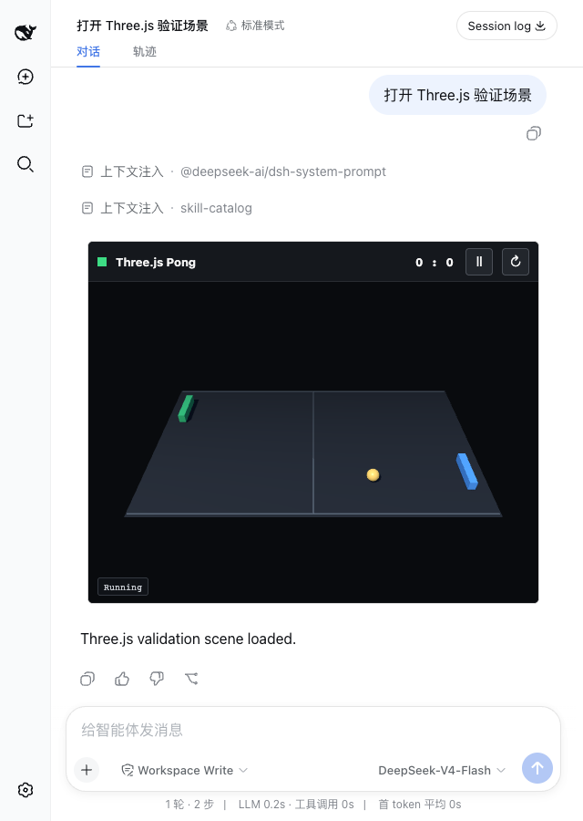

# M0 Validation Report

Date: 2026-08-15  
Status: **PASS**

## Scope

M0 validates only the high-risk runtime path:

- official `three@0.185.1` bundled from npm;
- one stdio MCP Server tool linked to `ui://threejs-editor/app`;
- a self-contained Pong View running inside the real `dsh-mcp-apps` double iframe;
- WebGL pixels, animation, keyboard input, pause/resume, responsive layout and console output.

Project persistence and Editor controls remain M1/M2 work.

## Results

| Gate | Evidence | Result |
|---|---|---|
| `threejs-editor-mcp` static checks | TypeScript, production build and MCP protocol test | PASS |
| `dsh-mcp-apps` checks | TypeScript, build and 3 package tests | PASS |
| MCP discovery | `mcp__threejs__open_three_demo` in the live Host catalog | PASS |
| Real Harness flow | Replay Agent called the MCP tool and rendered its App in Chat | PASS |
| Sandbox sizing | Outer iframe `748x414`; nested iframe `748x414` | PASS |
| WebGL canvas | `722x344` drawing surface | PASS |
| Nonblank pixels | 41,395 sampled; 7,737 lit; 240 sampled colors | PASS |
| Keyboard input | Left paddle Z changed from `0` to `-1.61007` | PASS |
| Pause/resume | Ball position remained stable while paused | PASS |
| Responsive layout | Canvas changed from `722x344` to `494x352` at 640px viewport | PASS |
| App diagnostics | No page error, console error or Three.js warning | PASS |



## Findings

### Resource size

The offline View is 862,453 bytes, or 208,945 bytes gzip. It correctly failed the Host's default 512 KiB Resource limit during the first E2E run.

The final fixture sets the existing `dsh-mcp-apps.maxBodyBytes` option to 2 MiB. The Host remains bounded; no size validation was removed.

### Nested iframe height

The Host resized its outer iframe to 406px, but the Sandbox's nested iframe stayed near the browser default because its wrapper used `min-height: 100%`.

M0 changes the generic wrapper to `html, body { width: 100%; height: 100% }`. The final E2E proved equal outer and inner dimensions. This is the only `dsh-mcp-apps` source adjustment; it adds no Three.js behavior and no fullscreen support.

### Replay isolation

The deterministic replay fixture records one Session. Final validation used a fresh isolated `DSH_HOME` so stale Sessions could not consume or invalidate the replay.

## Changes

`threejs-editor-mcp`:

- package, TypeScript and tsdown configuration;
- stdio Server and `ui://threejs-editor/app` Resource;
- official Three.js Pong View;
- MCP protocol test and Playwright browser gate;
- keyless Harness replay fixtures.

`dsh-mcp-apps`:

- one generic Sandbox height fix in `src/sandbox.ts`.

Unchanged:

- DeepSeek Harness product source;
- Agent Loop and Session semantics;
- fullscreen and `ui/message`.

## Verification

```sh
pnpm run check
pnpm run test:e2e:m0
```

Build artifacts:

- `dist/view.js`: SHA-256 `0116e05729a6e83769fd071736948a90c2cec00fe5cccbdf7ea6c588f042f12e`
- `dist/server.js`: SHA-256 `2ca6552129c0f4d1b8ec71b544270724d98703043ea086d25182f41cee371a77`

## Next Gate

M1 may add project create/open/pull/push and durable storage. It must not begin until this report is explicitly approved.
