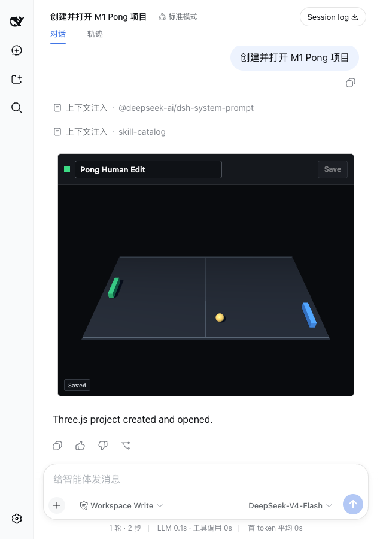

# M1 Validation Report

Date: 2026-08-15  
Status: **PASS**

## Scope

M1 validates the project boundary and App-to-Server save path:

- explicit project root through `--root` or `THREEJS_EDITOR_PROJECT_ROOT`;
- model-visible `list_projects`, `create_project`, and `open_editor`;
- app-only `pull_project` and `push_project`;
- versioned `project.json` with native Three.js scene and camera JSON;
- canonical JSON, SHA-256 revision, compare-revision, and atomic rename;
- real Harness creation, App loading, human title edit, save, and disk verification.

Hierarchy, TransformControls, Inspector, script editing, fullscreen, and
`ui/message` remain outside M1.

## Results

| Gate | Evidence | Result |
|---|---|---|
| `threejs-editor-mcp` checks | TypeScript, production build, and 1 protocol/storage test | PASS |
| `dsh-uni-editor` regression | TypeScript, build, and 3 Host tests | PASS |
| Tool visibility | Model tools marked `model`; pull/push marked `app` | PASS |
| Live Host catalog | Contains `create_project` and `open_editor`; excludes pull/push | PASS |
| Project root fence | Traversal and symlink project paths rejected | PASS |
| Project format | Schema 1 envelope with native Three.js scene/camera JSON | PASS |
| Three.js transforms | Serialized left paddle X is `-4.45` | PASS |
| Revision conflict | Stale push rejected without changing disk content | PASS |
| Atomic save | Final directory contains only `assets/` and `project.json` | PASS |
| Real Harness flow | Replay Agent created `m1-pong` and rendered its App | PASS |
| App-only pull | View loaded `Pong M1` at revision `6927cb21392a...` | PASS |
| Human save | Title became `Pong Human Edit` | PASS |
| Disk revision | App and file SHA-256 both `b264f894822e...` | PASS |
| Sandbox sizing | Outer and nested iframe both `748x422` | PASS |
| WebGL canvas | `722x344`; 41,395 samples, 7,730 lit, 245 colors | PASS |
| Responsive layout | Canvas changed to `494x352` at 640px viewport | PASS |
| Browser diagnostics | No page error, console error, or Three.js warning | PASS |



## Storage Contract

The Server accepts one explicit root and stores:

```text
<root>/
└── <project-id>/
    ├── project.json
    └── assets/
```

Project IDs match `[a-z0-9][a-z0-9-]{0,63}`. Existing project directories and
`project.json` must be real paths, not symlinks. Projects are limited to 2 MiB.

The revision is the SHA-256 digest of canonical `project.json` bytes. A save
rechecks `baseRevision`, writes a unique temporary file in the project
directory, and renames it over `project.json`. The protocol test verifies that
a stale save returns the current revision and leaves the accepted title intact.

## Runtime Findings

### SDK output validation

The MCP SDK validates structured error output as well as successful output.
`push_project` therefore declares one bounded output envelope covering success
and revision conflict instead of relying on `isError` to bypass validation.

### App auto-resize

Passing `{ strict: true }` to the MCP Apps `App` replaced the SDK's default
options and left the Host iframe at its initial 320px height. M1 now passes
`{ autoResize: true, strict: true }`. The final run proves equal outer and
nested iframe heights of 422px.

### Host boundary

M1 requires no additional `dsh-uni-editor` source change. It uses the M0-approved
generic nested-iframe height fix and the existing 2 MiB `maxBodyBytes` option.
Agent Loop, Session behavior, fullscreen, and `ui/message` remain unchanged.

## Verification

```sh
pnpm run check
pnpm run test:e2e:m1
```

Final artifacts:

- `dist/server.js`: 15,445 bytes, SHA-256 `60fac26ff80d57d3733f77db7d2f38c4e9f87cce36a8e4f7e3cdada8a10b9d84`
- `dist/view.js`: 863,613 bytes, SHA-256 `dc768290a2eb0456b6d99c0ae33fd1e0cbb74999204f8b5c357e3840698e1708`
- M1 screenshot: SHA-256 `9d5213a7d932048bc9f69abf785feacdc0e4b0ba1974f8fa3a682df4d5da6868`
- Saved `project.json`: 8,232 bytes, SHA-256 `b264f894822e34456585444e61fc5214f59c137f976cf462695cb408df54a8d3`

## Next Gate

M2 may add hierarchy, selection, TransformControls, Inspector, local history,
reload, and conflict-preserving UI. It must not begin until this report is
explicitly approved.
