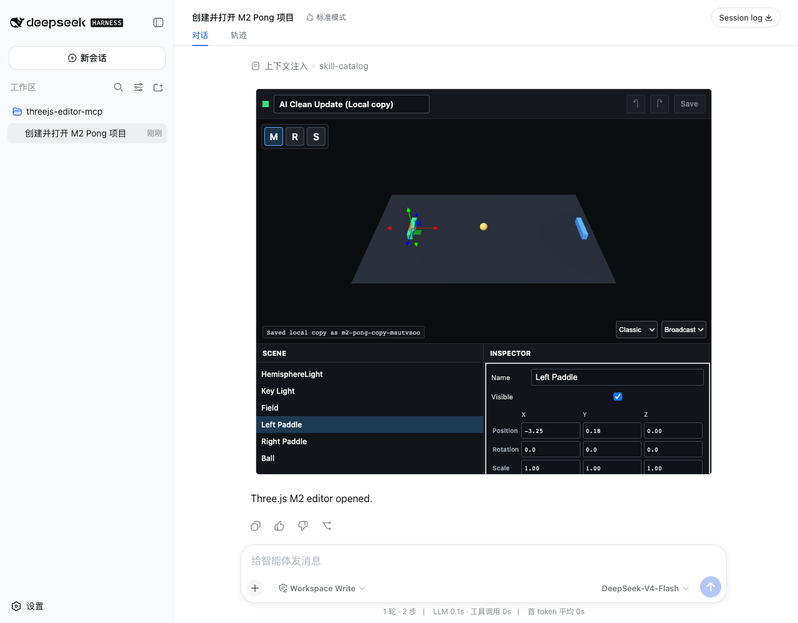

# M2 Validation Report

Date: 2026-08-15  
Status: **PASS**

## Scope

M2 validates the lightweight Editor and revision conflict workflow:

- native `project.scene` and `project.camera` loading through `ObjectLoader`;
- responsive Hierarchy, Viewport, and Inspector surfaces;
- hierarchy and raycast selection;
- official `OrbitControls` and `TransformControls`;
- name, visibility, position, rotation, scale, and material color fields;
- local undo/redo and persisted human operation summaries;
- clean external revision reload;
- dirty conflict detection with load-external and save-local-copy actions.

Script Play, runtime diagnostics reporting, model scene mutations, fullscreen,
and Agent Loop changes remain outside M2.

## Results

| Gate | Evidence | Result |
|---|---|---|
| `threejs-editor-mcp` checks | TypeScript, production build, and 1 protocol/storage test | PASS |
| `dsh-mcp-apps` regression | TypeScript, build, and 3 Host tests | PASS |
| Native scene load | Six stored scene objects appear in Hierarchy | PASS |
| Viewport selection | `Left Paddle` selected through Editor controls | PASS |
| Inspector transform | Position X changed from `-4.45` to `-3.75` | PASS |
| Local history | Undo restored `-4.45`; redo restored `-3.75` | PASS |
| TransformControls | Mode changed from move to rotate | PASS |
| Human save | Revision became `0072731c3796...` | PASS |
| Fresh App reload | Saved paddle X remained `-3.75` | PASS |
| Clean server update | Title auto-loaded as `AI Clean Update` | PASS |
| Dirty conflict | Local X `-3.25` remained while external revision was detected | PASS |
| Conflict preservation | Original and local copy persisted as separate projects | PASS |
| Original version | Title `AI Conflict Update`, paddle X `-3.75` | PASS |
| Local copy | Title `AI Clean Update (Local copy)`, paddle X `-3.25` | PASS |
| App-only copy tool | `save_project_copy` absent from live App catalog | PASS |
| Sandbox sizing | Outer and nested iframe both `748x636` | PASS |
| Desktop layout | Canvas `730x360`; panels `365x210` each | PASS |
| Narrow layout | Canvas `494x360`; panels `247x210` each | PASS |
| WebGL pixels | 43,800 sampled; 8,535 lit; 63 colors | PASS |
| Browser diagnostics | No page error, console error, or Three.js warning | PASS |



## Editor Contract

The View edits the deserialized Three.js objects directly. The scene graph is
the state model; no second component state tree mirrors it. Save temporarily
removes the TransformControls helper, updates object matrices, and serializes
the scene and camera with the official `toJSON()` format.

Local history stores at most 50 project snapshots. Visible controls create
history entries only when an edit settles, not on every input event.

The existing `editor` envelope records:

```json
{
  "layout": "classic",
  "cameraView": "broadcast",
  "operations": ["Updated Left Paddle position"]
}
```

`inspect_project` exposes this compact summary to the model without returning
the complete project JSON.

## Conflict Contract

The App polls `pull_project` with its current revision:

- clean App + newer revision: load the external project and reset local history;
- dirty App + newer revision: retain local objects and show conflict actions;
- load external: accept the external project;
- save local copy: call app-only `save_project_copy` with a new project ID.

The final E2E wrote:

- original `m2-pong`: revision `9d68bc8f29d2...`;
- local copy `m2-pong-copy-msutvsoo`: revision `b16eea1c696f...`.

The original retained the external title and prior saved transform. The copy
retained the dirty local transform. No force-overwrite path exists.

## Runtime Findings

### Hidden grid row

The hidden conflict bar initially left grid auto-placement to move the
workspace into the conflict row, creating unused space below the Editor.
Explicit `grid-row: 2` and `grid-row: 3` assignments keep the workspace stable
whether the conflict bar is visible or hidden.

### Inline responsive layout

A three-column Editor at the real 748px card width made the Viewport too narrow.
At 760px and below, M2 now places the full-width Viewport above two equal
Hierarchy and Inspector columns. The final desktop and 640px page runs prove
the same layout without overlap.

### Save and polling race

A poll started before local save could return the save's new revision after the
save settled and relabel it as an external update. Poll responses are now
ignored while saving or when their revision already equals the App revision.

### Host boundary

M2 requires no additional `dsh-mcp-apps` change. The View remains in the
existing inline double iframe and uses only app-only MCP tool calls for human
save and conflict-copy actions.

## Verification

```sh
pnpm run check
pnpm run test:e2e:m2
```

Final artifacts:

- `dist/server.js`: 23,813 bytes, SHA-256 `81fa51cbc952cbcacc142499e31a36ebb56e8fa16714612fab54395ae0f3ef1d`
- `dist/view.js`: 1,043,131 bytes, SHA-256 `1fb962c3c797ed95457560397a2bc54b215028d81bba9368c44935cf1a7e480b`
- M2 screenshot: SHA-256 `c8e1db0c6e5f2b1011e2da703aa96a290b7637f71745d5837ddf602a896d5a3d`
- Original project: SHA-256 `9d68bc8f29d23cf5a4350484bcb84088dbfed57b90e3a390b08b1225c72f1694`
- Local copy: SHA-256 `b16eea1c696f9dc0b77cab49cd05e66c306b6783904b02b630fed72c7aa4840a`

## Next Gate

M3 may add the script lifecycle, Play mode, runtime diagnostics, model scene
operations, and one normal composer turn that reads and fixes the latest human
revision. It must not begin until this report is explicitly approved.
