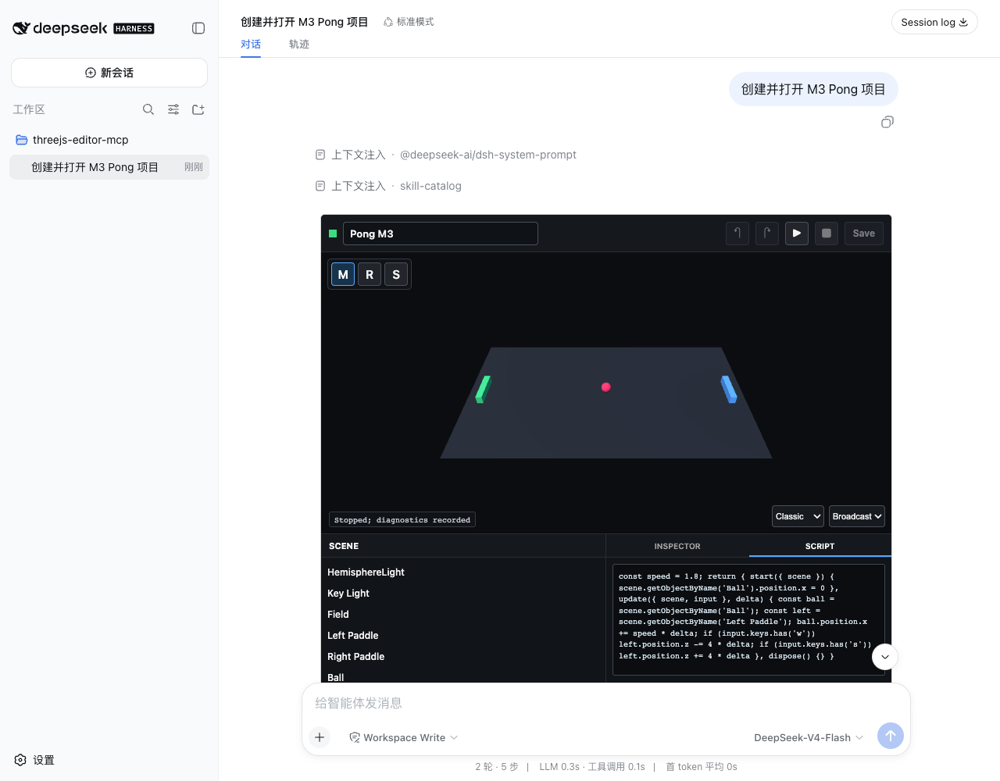

# M3 Validation Report

Date: 2026-08-15  
Status: **PASS**

## Scope

M3 validates the game runtime and turn-based human/AI collaboration path:

- Script panel with persisted source and local history;
- `start(context)`, `update(context, delta)`, and `dispose(context)` lifecycle;
- Play/Stop with keyboard and pointer input;
- revision-bound runtime errors and warnings in `diagnostics.json`;
- model-visible scene/script inspection, project checking, and bounded changes;
- one normal second Composer message that reads the human revision and fixes it;
- clean App polling that loads the AI revision without another Editor card.

Assets, export, package release hardening, fullscreen, `ui/message`, and Agent
Loop changes remain outside M3.

## Results

| Gate | Evidence | Result |
|---|---|---|
| `threejs-editor-mcp` checks | TypeScript, production build, and protocol/storage test | PASS |
| `dsh-uni-editor` regression | TypeScript, build, and 3 Host tests | PASS |
| Tool visibility | Inspect/apply/check are model-visible; pull/push/report are app-only | PASS |
| Script editing | Human source persisted with operation `Updated game script` | PASS |
| Save-before-Play | Dirty source disabled Play until `push_project` succeeded | PASS |
| Runtime lifecycle | Browser executed start/update/dispose inside the MCP App Sandbox | PASS |
| Runtime failure | `human runtime failure` captured without a page or console error | PASS |
| Diagnostic revision | Error recorded against human revision `e643e7f9e6d8...` | PASS |
| Diagnostic isolation | `diagnostics.json` did not change `project.json` revision | PASS |
| Human/AI boundary | App save produced no Agent turn; next Composer message started turn 2 | PASS |
| AI inspection | Turn 2 read the human script, objects, full revision, and runtime error | PASS |
| Revision-checked AI edit | Apply used full human revision as `baseRevision` | PASS |
| AI result | Script fixed and Ball color changed to `#ff3366` | PASS |
| Clean App refresh | App loaded AI revision `59503ba4f2b9...` automatically | PASS |
| Keyboard input | W moved Left Paddle Z from `0` to `-0.2004` | PASS |
| Pointer input | Canvas center reported `x=0`, `y=0`, primary button `[0]` | PASS |
| Game update | Ball moved from X `0` to `0.31428` | PASS |
| Stop restore | Ball X and paddle Z both returned to `0` | PASS |
| Final diagnostics | AI revision reported 0 errors and 0 warnings | PASS |
| Sandbox sizing | Outer and nested iframe both `748x636` | PASS |
| WebGL canvas | `730x360`; 43,800 samples, 8,535 lit, 63 colors | PASS |
| Browser diagnostics | No page error, console error, or Three.js warning | PASS |



## Runtime Contract

The project script is a factory body that returns:

```js
return {
  start(context) {},
  update(context, delta) {},
  dispose(context) {},
}
```

The Browser compiles this source only inside the existing different-origin MCP
App Sandbox. The context contains `THREE`, scene, camera, renderer, and input.
Input exposes normalized pointer coordinates, pressed pointer buttons, and a
lowercase keyboard key set. External imports remain unsupported.

Play requires a clean saved revision. Runtime mutations therefore cannot be
misreported as diagnostics for unsaved source. Stop calls `dispose`, restores
the saved scene snapshot, and reports at most 20 bounded errors and warnings
through app-only `report_diagnostics`.

## Diagnostic Contract

`diagnostics.json` contains:

```json
{
  "testedRevision": "59503ba4f2b9a6438a1e770fddcb2280dbcb40b2cfdcf2b41325f87d231b41bc",
  "updatedAt": "2026-08-16T01:17:31.261Z",
  "errors": [],
  "warnings": []
}
```

The file is written with a temporary file and atomic rename under the same
project lock as `project.json`. A stale `testedRevision` is rejected. Because
diagnostics are separate from `project.json`, Play observations do not create
an edit revision or trigger App conflict handling.

`check_project` combines scene/camera loading, script syntax, and runtime
diagnostics only when `testedRevision` equals the current project revision.
Older diagnostics are reported as stale warnings instead of being attributed
to newer code.

## Model Operations

M3 adds three model-visible capabilities:

- `inspect_project`: full revision plus compact objects, transforms, colors,
  script source, human operations, and diagnostics;
- `apply_scene_changes`: one compare-revision batch for object, primitive,
  project-setting, and script operations;
- `check_project`: current structural, syntax, and runtime findings.

The final Harness session proves the intended sequence:

1. Turn 1 called `create_project` and mounted one Editor.
2. Human Script edit, app-only save, Play, and diagnostics stayed outside the
   Agent Loop.
3. The next ordinary Composer message started turn 2.
4. Turn 2 called `inspect_project` and read revision `e643e7f9...` with the
   recorded runtime error.
5. Turn 2 called `apply_scene_changes` with that exact 64-character
   `baseRevision`.
6. The Server committed revision `59503ba4...`; the existing clean App loaded
   it through `pull_project`.

Harness renders an MCP tool's text content to the model while retaining
`structuredContent` for validated result metadata. `inspect_project` therefore
places its complete compact JSON summary in the text block as well as
`structuredContent`; the model can read and reuse the full revision without
receiving raw `project.json`.

## Host Boundary

M3 adds no `dsh-uni-editor` feature and changes no Harness source. It uses the
existing inline App card, app-only bridge, polling, Sandbox Proxy, and the
M0-approved nested iframe height fix. The final live catalog exposed only
`create_project` and `open_editor` as App-rendering tools; mutation tools did
not mount duplicate Editors.

## Verification

```sh
pnpm run check
pnpm run test:e2e:m3
```

Final artifacts:

- `dist/server.js`: 39,217 bytes, SHA-256 `5a23556b27512ba5f2f287462e25d578efe0701eaaa12a55169d26b482c9b5c6`
- `dist/view.js`: 1,121,545 bytes, SHA-256 `ea6abfb55ae3b683234a76a6566d70cf73f01a38b87f32d1a3464aa3334e9c1f`
- M3 screenshot: 98,785 bytes, SHA-256 `e8e5fceb05196cf54f3856b31de5f389b78f5d60962cd96527d733552967d229`
- Final `project.json`: 8,737 bytes, SHA-256 `59503ba4f2b9a6438a1e770fddcb2280dbcb40b2cfdcf2b41325f87d231b41bc`
- Final `diagnostics.json`: 168 bytes, SHA-256 `8ba8f172a8f429abcab545d459d8a8703303cc74924de1e2c4d64cf69be5e293`

## Next Gate

M4 may add bounded GLTF/texture assets, export, CI, packed-install checks, and
npm release hardening. It must not begin until this report is explicitly
approved.
