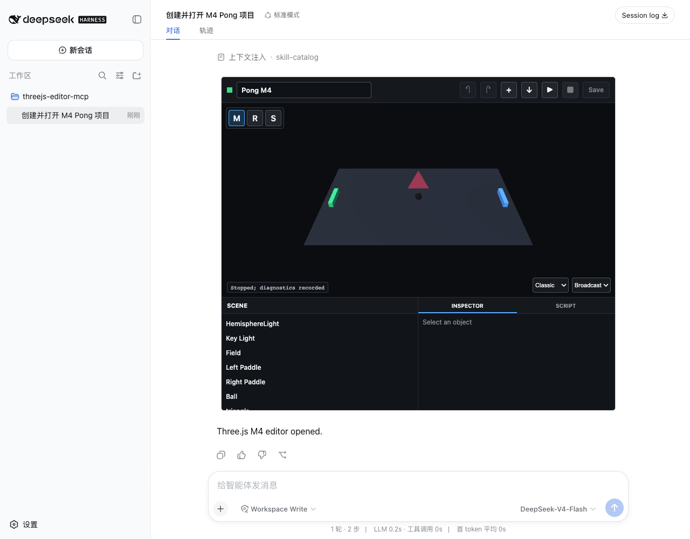

# M4 Validation Report

Date: 2026-08-15  
Status: **PASS**

## Scope

M4 completes the bounded asset and release surface:

- local GLB 2.0, PNG, and JPEG import;
- texture and imported geometry persistence through native Three.js JSON;
- project export through standard MCP Apps `ui/download-file`;
- asset inspection, copy, validation, and security limits;
- npm `0.1.0` metadata, README, MIT license, CI, and trusted publish workflow;
- tarball installation and executable verification;
- final Harness Browser E2E using the executable installed from the tarball.

Fullscreen, arbitrary external assets, large asset management, App-originated
Agent messages, and npm publication remain outside M4.

## Results

| Gate | Evidence | Result |
|---|---|---|
| Release checks | TypeScript, production build, protocol/storage test, tarball install | PASS |
| Host regression | `dsh-uni-editor` typecheck, build, and 3 tests | PASS |
| Package version | `threejs-editor-mcp@0.1.0` | PASS |
| Tarball contents | Only `dist/server.js`, `dist/view.js`, `README.md`, `LICENSE`, `package.json` | PASS |
| Executable install | Fresh offline install launched `node_modules/.bin/threejs-editor-mcp` | PASS |
| Harness package path | Final Browser E2E used the installed bin, not source `dist/server.js` | PASS |
| Public catalog | Only `create_project` and `open_editor` mount Apps | PASS |
| Tool visibility | `put_asset` and `export_project` are app-only | PASS |
| GLB import | 556-byte GLB stored and rendered as `Imported_Triangle` | PASS |
| Texture import | 69-byte PNG applied to Ball and persisted as a data URL | PASS |
| Asset metadata | Name, MIME, size, and SHA-256 exposed by `inspect_project` | PASS |
| Asset copy | Conflict-copy flow copies original assets | PASS |
| Export | Downloaded `m4-pong.threejs-project.json` with project, revision, and both assets | PASS |
| Revision integrity | Stored bytes hash equals revision `3427bfb1489c...` | PASS |
| Agent boundary | App import/save/export produced no Agent turn; Composer remains the turn boundary | PASS |
| Path security | Project traversal and project/assets symlink escape rejected | PASS |
| File security | Bad magic, external GLB URI, MIME mismatch, stale revision, and oversize rejected | PASS |
| Origin security | Cross-origin Host API request returned HTTP 403 | PASS |
| Final diagnostics | 0 errors and 0 warnings for the saved revision | PASS |
| Sandbox sizing | Outer and nested iframe both `748x636` | PASS |
| WebGL canvas | `730x360`; 43,800 samples, 8,520 lit, 65 colors after import | PASS |
| Browser diagnostics | No page error, console error, or Three.js warning | PASS |



## Asset Contract

The Server accepts only:

| Type | Extensions | Validation |
|---|---|---|
| GLB 2.0 | `.glb` | Magic, version, declared length, JSON chunk, no external resource URI |
| PNG | `.png` | PNG signature |
| JPEG | `.jpg`, `.jpeg` | JPEG signature |

Limits are:

- 256 KiB per asset;
- eight assets per project;
- 512 KiB total per project;
- lowercase names with letters, numbers, dot, dash, or underscore;
- exact extension and MIME agreement.

`put_asset` requires the current project revision. The Server writes through a
mode-0600 temporary file and atomic rename under the project lock. Asset
directories must be real directories inside the real project directory;
symlinks and root escape are rejected.

The App uses the official `GLTFLoader`. Imported GLB geometry becomes native
scene JSON. PNG/JPEG textures are decoded in the Sandbox and persist as data
URLs in native Three.js texture/image tables. Original bounded files remain
under `assets/` for inspection, copy, and export.

## Export Contract

The app-only `export_project` tool returns one bounded JSON document:

```json
{
  "format": "threejs-editor-mcp",
  "formatVersion": 1,
  "projectId": "m4-pong",
  "revision": "3427bfb1489c611c6532418386c6e9efd5a708712bcd60eb6a8d05eaa00d89a2",
  "project": {},
  "assets": []
}
```

Direct iframe downloads are blocked by the MCP Apps Sandbox. `dsh-uni-editor`
therefore implements standard `ui/download-file` for one embedded JSON
resource up to 4 MiB. The outer Host validates the file URI, MIME, filename,
and size before creating the browser download.

The downloaded file contained:

- the exact saved revision;
- the complete project envelope;
- `ball.png` with SHA-256
  `2137d28e9d1438d6719fcc9f393cf94eab4a26534db86c011cb4ac870df0f06f`;
- `triangle.glb` with SHA-256
  `4665f2df1beb67698e59b3ae4246f1d764a40295742cd0da84197ed89f387a15`.

## Node Inspection

Three.js `ObjectLoader` normally needs browser `document` when scene JSON
contains texture images. The first Browser run exposed this in
`inspect_project` after a valid texture save.

The Server now parses a texture-free copy for structural inspection and model
operations, then restores the original texture/image references when it
serializes a changed scene. A protocol regression test persists a texture,
inspects it in Node, applies later scene operations, and verifies that the
texture tables and material reference survive.

The second Browser run reached inspection successfully. Its only failure was
an incorrect test expectation: official `GLTFLoader` normalizes the node name
`Imported Triangle` to `Imported_Triangle`. The assertion was corrected. The
third run used a fresh profile and project root and passed end to end.

## Agent Boundary

The release View contains no `sendMessage` call. Import, texture application,
Save, export, Play, and diagnostics remain app-only operations. Save produces
a durable revision but never starts or queues Agent work. The user starts the
next turn naturally through the existing Harness Composer.

The final replay contains only the initial create tool call and its completion
text. Asset import and Save completed without consuming another model
response.

## Release Contract

Added:

- package metadata and public `0.1.0` version;
- executable shebang and executable tarball bin;
- README with architecture, installation, tools, limits, and security;
- MIT license;
- `.github/workflows/ci.yml`;
- `.github/workflows/publish.yml` using npm provenance;
- `prepack`, `release:check`, and `test:pack`.

`test:pack` builds the real tarball, installs it into a fresh directory using
the local pnpm store, launches its generated bin, creates a Pong project, and
reads `ui://threejs-editor/app`.

The public npm registry currently returns 404 for `threejs-editor-mcp`; the
package is not published. Publication requires repository approval plus npm
trusted-publisher configuration and is not performed by this validation.

## Browser Evidence

The final run used:

```text
Harness URL:
  http://127.0.0.1:51775

MCP executable:
  /tmp/threejs-editor-m4.Wpn2yo/installed/node_modules/.bin/threejs-editor-mcp

Project root:
  /tmp/threejs-editor-m4.Wpn2yo/projects-final
```

Observed:

- outer iframe: `748x636`;
- nested iframe: `748x636`;
- canvas: `730x360`;
- initial WebGL: 43,800 samples, 8,535 lit, 63 colors;
- final WebGL: 43,800 samples, 8,520 lit, 65 colors;
- one Editor card;
- 0 Browser/Three.js problems;
- final diagnostics bound to the exact saved revision with 0 errors and 0 warnings.

## Verification

```sh
pnpm run release:check
pnpm run test:e2e:m4

cd ../dsh-uni-editor
pnpm run check
```

Final artifacts:

- `dist/server.js`: 51,530 bytes, SHA-256
  `5c4fe1062023b6331ebeb00d087825f0080e6c3ceb8ec7d6f3bb43454da26221`;
- `dist/view.js`: 1,168,472 bytes, SHA-256
  `25bcf8969e0523b12295ff19753236ba779bde9157bcd696c39bc896dd655d07`;
- `threejs-editor-mcp-0.1.0.tgz`: 304,753 bytes, SHA-256
  `f4cbb380b2de0b7b6d9b21b0d67a3f39afefa3a0ab002ff8d99669ae5f032d64`;
- M4 screenshot: 73,737 bytes, SHA-256
  `12a57f0f19ceb86946a4428b0a348f3e8eb94a6eb19f736c97de9890b694a032`;
- final `project.json`: SHA-256
  `3427bfb1489c611c6532418386c6e9efd5a708712bcd60eb6a8d05eaa00d89a2`;
- final `diagnostics.json`: SHA-256
  `16a31473def38eebe22571bbdae85cd5d4d08e86d98fafbea79bd0603f919dcf`.

## Approval Gate

M4 implementation and validation are complete. No commit, push, GitHub Release,
or npm publication will occur until this report and screenshot are explicitly
approved.
