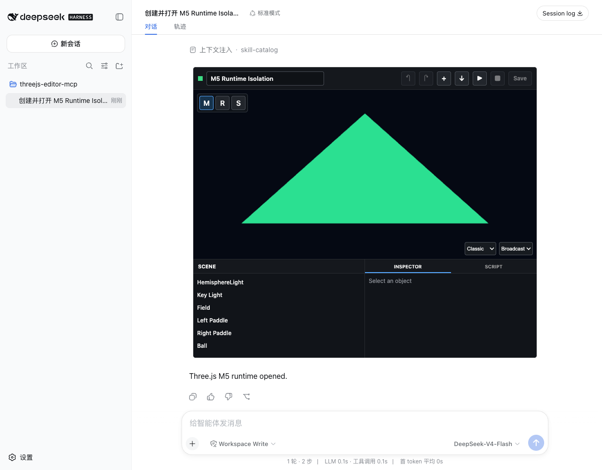

# M5 Validation Report

Date: 2026-08-17
Status: **PASS, approved**

## 中文审阅摘要

M5 已完成并通过最终验证：

- 固定 Three.js r185 Editor core 与外部复杂图形语料的 repo、commit、许可证和哈希；
- 证明官方 `Command` / `History` 可序列化，并证明人工操作与 AI typed batch
  可产生完全一致的 Scene JSON；
- App 通过标准 MCP Resource 读取双模块 Runtime 和 Command proof，未创建新的
  Agent turn，也未改变 project revision；
- 在 Harness Proxy 和 MCP App 内增加第三层 opaque Runtime Sandbox；
- 真实 Harness Browser E2E 已通过 WebGL2、WebGPU、DOM/导航/AppBridge 隔离、
  伪造 RPC、build error、unhandled rejection 和 teardown 验证；
- `dsh-uni-editor` 仅增加受控 `frame-src 'self'`，外部 frame 仍需显式 allowlist；
- 748x636 inline 卡片可继续作为默认入口；M6 将增加标准 fullscreen，服务于本地
  多文件工程的 Files、Viewport 和 Inspector 深度编辑。

M5 尚未实现本地工程目录注册、事务日志或文件级 MCP tools；这些严格属于 M6。
本报告已获确认，M6 可在下一阶段开始。

## Scope

M5 validates the foundations required before opening local multi-file projects:

- a pinned compatibility corpus and Three.js r185 Editor core snapshot;
- official Command/History serialization and human/AI operation equivalence;
- standard MCP Resource loading without a new Agent turn or project revision;
- a third, opaque Runtime Sandbox inside the existing MCP App Sandbox;
- WebGL2 rendering, WebGPU capability detection, diagnostics, and teardown;
- the minimal `dsh-uni-editor` CSP change needed for controlled `srcdoc` frames.

Linked Workspace registration, local file transactions, module building, and
the final `inspect_editor` / `apply_editor_commands` tools remain M6/M7 work.

## Results

| Gate | Evidence | Result |
|---|---|---|
| Release checks | Upstream hashes, TypeScript, build, protocol/storage test, packed install | PASS |
| Host regression | `dsh-uni-editor` typecheck, build, and 3 tests | PASS |
| Compatibility corpus | External graphics corpus fixed at commit `98453747...` with 7 case IDs | PASS |
| Official Editor source | Three.js r185 commit `2431a09f...`; 28 files verified by SHA-256 | PASS |
| Command JSON | `AddObjectCommand` serialized, restored, executed, undone, and redone | PASS |
| History JSON | Serialized History restored into a fresh Editor and redone | PASS |
| Human/AI equivalence | Direct Commands and typed batch adapter produced identical Scene JSON | PASS |
| Batch history | `MultiCmdsCommand` undo restored baseline and redo restored final state | PASS |
| MCP Resources | Runtime graph and Command proof read through `readServerResource()` | PASS |
| Revision neutrality | Project SHA-256 stayed `ce7fabd0...` across both Resource reads | PASS |
| Three-layer isolation | Harness Proxy -> MCP App -> opaque Runtime iframe | PASS |
| Runtime sandbox | `sandbox="allow-scripts"`; origin `null`; no `allow-same-origin` | PASS |
| DOM boundary | Runtime could not read the parent Editor DOM | PASS |
| Navigation boundary | Top navigation was blocked by the browser sandbox | PASS |
| AppBridge boundary | Runtime saw no AppBridge global; forged `tools/call` gained no authority | PASS |
| WebGL2 | Triangle rendered; 75,600 samples, 17,783 lit, 5 colors | PASS |
| WebGPU | API present and `requestAdapter()` returned an adapter | PASS |
| Diagnostics | Expected unhandled rejection and unresolved module error were observed | PASS |
| Teardown | Runtime hidden; frame stable; 0 messages after Stop | PASS |
| Browser diagnostics | 0 unexpected console or page errors | PASS |



The full machine-readable result is in
[`M5-isolation-trace.json`](M5-isolation-trace.json).

## Upstream Contract

The npm `three` package remains the primary runtime dependency. It exports core,
addons, WebGPU, TSL, and source modules, but not `editor/js/*`. M5 therefore
vendors only the unmodified Editor Command/History subset required for stable
editing semantics.

The snapshot is fixed to:

```text
Repository: https://github.com/mrdoob/three.js
Tag:        r185
Commit:     2431a09f46f34c560bc8e44b33be0e567723d5b9
Files:      28, including LICENSE
Manifest:   vendor/three-editor/r185/upstream.json
```

`node scripts/sync-three-editor.mjs` performs an offline hash check. Network
access occurs only with `--sync`. Attribution is retained in
`THIRD_PARTY_NOTICES.md` and the upstream MIT license.

The external MIT-licensed graphics corpus is fixed in `corpus/m5.json`:

```text
Threejs-Awesome-Graphics-Agent-Skills 0.8.0
commit 98453747cc0678f6a5d910f38d7483596a5f9a40
```

Its source remains external and is not included in the npm tarball.

## Command Proof

Both Node and the MCP App compute the same proof from the pinned upstream code:

```json
{
  "upstream": "three.js r185",
  "addObjectRoundTrip": true,
  "historyRoundTrip": true,
  "humanAiEquivalent": true,
  "batchUndoRedo": true,
  "finalPosition": [1.25, 2.5, -0.75],
  "finalRoughness": 0.35
}
```

The human path executes `SetPositionCommand` and `SetMaterialValueCommand`
directly. The AI prototype accepts typed values and maps both operations into
one official `MultiCmdsCommand`. This proves the shared editing primitive
without prematurely exposing one MCP tool per upstream Command.

## Resource And Runtime Contract

The Server exposes:

```text
threejs-m5://runtime/module-graph
threejs-m5://official-editor/command-proof
```

The App reads both through standard MCP Apps `readServerResource()`. The replay
contains only the initial `create_project` tool call and completion text; both
Resource reads occur inside the existing App and leave the project revision
unchanged.

The resulting frame tree is:

```text
Harness page
└── Sandbox Proxy iframe             748x636
    └── MCP App iframe               748x636
        └── Runtime iframe           730x360, origin null
```

Runtime modules are linked to Blob ESM URLs inside the opaque frame. Every
message includes the expected channel, `runId`, and nonce. Stop disposes the
module, cancels animation, revokes Blob URLs, removes the frame source, and
rejects late events.

## Host CSP

`dsh-uni-editor` changes the default frame directive from:

```text
frame-src 'none'
```

to:

```text
frame-src 'self'
```

Explicit `frameDomains` remain additive and origin-validated. This permits the
same-origin `srcdoc` child required by an MCP App while still denying arbitrary
external frame origins. The inner App must independently declare its iframe
sandbox; M5 grants only `allow-scripts`.

## Runtime Findings

### Expected security console message

Chrome logs an error when the fixture deliberately attempts top navigation.
The message states that `allow-top-navigation` is absent. The E2E classifies
this specific message as positive security evidence; all other console errors
and page errors remain failures.

### Teardown ownership

Final review found two assignments to `app.onteardown`; the M5 assignment would
have replaced the existing Editor cleanup. They were merged into one handler
that stops the Runtime and then releases polling, game state, animation,
controls, scene resources, renderer, and timer. The protocol test asserts that
the bundled View registers exactly one teardown handler.

### Inline and fullscreen

At the real 748x636 card size, a 730x360 Runtime Viewport is usable and remains
the default entry. M6 will add standard fullscreen as a depth mode for Files,
Viewport, and Inspector work on local multi-file projects; it is not required
to open or run the inline App.

## Verification

```sh
pnpm run release:check

cd ../dsh-uni-editor
pnpm run check

cd ../threejs-editor-mcp
DSH_WEB_URL=http://127.0.0.1:51789 \
THREEJS_EDITOR_MCP_ROOT="$PWD" \
THREEJS_EDITOR_MCP_PROJECTS=/tmp/threejs-editor-m5-final-projects-20260817 \
pnpm run test:e2e:m5
```

The Browser run used a fresh profile and fresh project root:

```text
DSH_HOME:    /tmp/threejs-editor-m5-final-home-20260817
Project root:/tmp/threejs-editor-m5-final-projects-20260817
Harness URL: http://127.0.0.1:51789
```

Final artifacts:

- `dist/server.js`: 110,391 bytes, SHA-256
  `2a1790459ff2717d2ddc3c4801d714c83ab0959a44370d67821416d361c5e48a`;
- `dist/view.js`: 1,207,830 bytes, SHA-256
  `577576e7ced6308eb6234e3dd3bf2172fdca0869d53b7defbac68e6727386f03`;
- M5 screenshot: 77,037 bytes, SHA-256
  `436637bbef4427f0051c04e261097a74caded62247f312ebb7121c4dac721c89`;
- upstream manifest: 3,355 bytes, SHA-256
  `d2e81d3445665573e3c4443a8e00425dc5b20b0af31f5b1d108cf4e5e94828e4`;
- corpus manifest: 1,150 bytes, SHA-256
  `e77046d26677c5ef945039efbe792f917b3164cab70e042a7939069734366d39`;
- fixture `project.json`: 9,935 bytes, SHA-256
  `ce7fabd0ccf3fc0680ee6ce9ab54e1c30c9b315d8c74c5729e1706a943747d2e`.

## Approval Gate

M5 implementation and validation are complete and were approved on 2026-08-17.
M6 Linked Workspace was subsequently implemented and approved on 2026-08-18.
