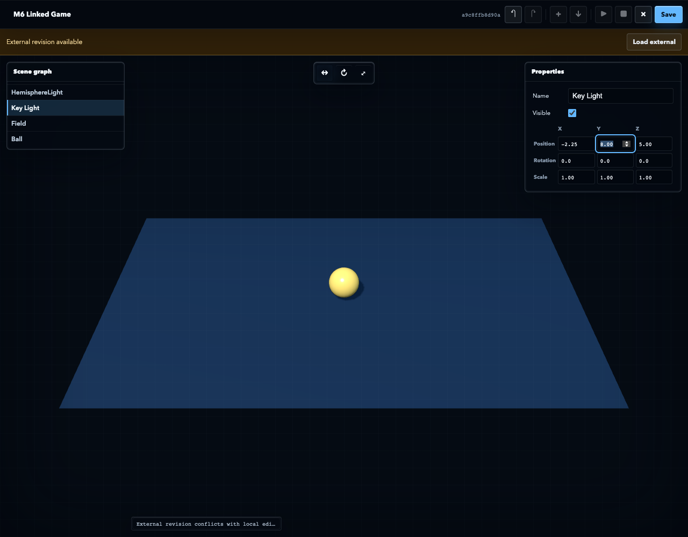
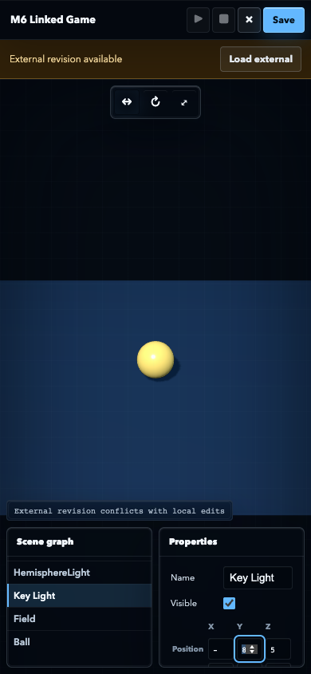

# M6 Validation Report

Date: 2026-08-18
Status: **PASS, approved**

## 中文审阅摘要

M6 已完成实现和最终验证：

- Linked Workspace 可通过 Server allowlist 和 `projectId=path` 注册后原地打开；
- Managed Workspace 使用同一 manifest、revision、transaction 和 recovery 契约；
- 人工 Scene 操作和 AI typed operations 共用 Three.js r185 官方 Editor Command；
- Human UI 采用 Canvas-first VFX 工具布局，只提供 Scene graph、Properties、Transform、
  Play、资产和保存能力，不提供 Files 或 Script 编辑入口；
- 已将 Taste 仓库全部 13 个 Skill 软链接到 TRAE 用户 Skill 目录；
- 本轮按 `redesign-existing-projects` 先审计现有 UI，再使用
  `high-end-visual-design` 的 Ethereal Glass 方向实施，没有混入 landing-page、
  imagegen、minimalist 或 brutalist 规则；
- 用户从三种独立视觉原型中选择 A `Ethereal Glass`；该方向现已通过
  `data-ui-direction="ethereal-glass"` 固化为正式 Editor 契约，B/C 只保留为设计探索证据；
- Editor chrome 使用 46% 透明双层玻璃边缘、冷中性黑表面、tabular numeric
  和单一冰蓝交互反馈；新建项目使用冷黑蓝舞台、Fog、clearcoat 高光和真实阴影，
  不覆盖已存在工程自己的 Scene 背景；
- 人工保存不创建 Agent turn，下一条 Composer 消息才触发 AI；
- AI 在人工保存的 exact revision 上原子修改两个文件，clean App 在同一卡片刷新；
- dirty App 收到新 revision 时保留未保存的 Scene 操作并要求显式加载；
- transaction journal、content-addressed recovery objects 和 atomic `HEAD` 已验证；
- stale revision、路径穿越、绝对路径、metadata、symlink、oversize 和 crash recovery
  均有负向测试；
- 标准 MCP Apps fullscreen 在同一个 iframe、bridge、session 和 Chat 卡片内切换；
- Three.js package release checks、`dsh-mcp-apps` checks 和 fresh Harness Browser E2E
  全部通过。

M6 没有实现通用 Vite/ESM/TypeScript 构建、source map 或任意复杂项目运行。
这些仍属于 M7。M7 在本报告获批准前不得开始。

## Scope

M6 makes source files, configuration, assets, and the Scene projection part of
one immutable Workspace revision. It adds:

- Linked and Managed Workspace registration;
- canonical file manifests and SHA-256 revisions;
- atomic multi-file transactions with recovery journals;
- file read, search, apply, export, and Scene projection paths;
- typed official Editor Command tools for AI;
- a Canvas-first Scene UI, conflict handling, and fullscreen editing for humans;
- V1 and V2 routing without migrating existing V1 projects.

File tools remain available to the model and App protocol, but the current
human-facing UI intentionally exposes no source-code editor.

## Results

| Gate | Evidence | Result |
|---|---|---|
| Release checks | Upstream hashes, TypeScript, build, Node tests, packed install and executable | PASS |
| Host regression | `dsh-mcp-apps` typecheck, build, and 3 tests | PASS |
| Linked Workspace | Existing Git directory opened in place through registered `projectId` | PASS |
| Managed Workspace | Created and rediscovered after Store restart | PASS |
| Model path boundary | Replay tool arguments contained only `projectId` and relative file paths | PASS |
| Revision integrity | Every persisted revision filename matched the manifest SHA-256 | PASS |
| Human Scene edit | `Key Light` transform used `SetPositionCommand` | PASS |
| Scene-only UI | Taste Ethereal Glass Canvas-first chrome visible; no Files, Script, VFX label, or legacy scene presets | PASS |
| Agent-loop boundary | Human Scene save produced no AI response | PASS |
| AI collaboration | Next Composer turn inspected the human revision and changed two files atomically | PASS |
| Same-card refresh | Clean Editor loaded the AI revision without creating another App card | PASS |
| Dirty conflict | External revision preserved the unsaved Scene transform and exposed `Load external` | PASS |
| Git visibility | Scene, source, and game-state changes were visible through `git diff` | PASS |
| Transaction journal | AI two-file transaction was `committed` with matching base and target revisions | PASS |
| Atomic `HEAD` | Final `HEAD` matched the externally committed revision | PASS |
| Recovery | Prepared transaction recovery and external-edit refusal passed | PASS |
| File fidelity | Unknown text and binary data round-tripped without format conversion | PASS |
| File safety | Traversal, absolute path, metadata, symlink, stale, and oversize inputs rejected | PASS |
| Fullscreen | Same App expanded to 1280x1000 and returned inline without bridge replacement | PASS |
| Compact layout | 390x844 viewport had no horizontal overflow; panels did not overlap | PASS |
| Browser diagnostics | 0 unexpected console or page errors | PASS |





The full machine-readable result is in
[`M6-workspace-trace.json`](M6-workspace-trace.json).

## Workspace Contract

Linked Workspaces are registered only through Server startup configuration:

```text
--workspace-root <allowlisted-root>
--workspace linked-game=<authorized-path>
```

Model-facing tools accept `projectId`, not an absolute directory. Workspace
paths are relative POSIX paths and reject absolute paths, backslashes, NUL,
empty segments, `.`, `..`, `.threejs-editor/*`, symlinks, and non-regular
files. Scans exclude `.git`, `.threejs-editor`, `dist`, and `node_modules`.

M6 limits a Workspace to 512 files, 1 MiB per file, and 16 MiB total. Text
search reads at most 512 KiB per file.

The V2 metadata layout is:

```text
.threejs-editor/
├── project.json
├── HEAD
├── revisions/
├── objects/
├── transactions/
├── builds/
└── diagnostics/
```

## Revision And Transaction Proof

The human Scene save produced:

```text
b26a3d08d9870570599e2ab7e6e5da198ca0b33052c635c6ff294756d2f9c5e5
```

The deterministic Replay then called `inspect_project` and used that exact
revision as `apply_project_files.baseRevision`. One transaction changed:

```text
src/main.js
src/game-state.js
```

Its committed target revision was:

```text
a9c8ffb8d90a088c72fccfd6adedfb7f9a25451b998ca505e50a03bcde339885
```

An independent MCP client then changed `src/game-state.js`, producing:

```text
67e43f380496c829a566e701d8ba2fa83aa04df0e75de6bbcaacc49a0081bf11
```

The Editor was dirty at that point. It entered conflict without replacing the
local `Key Light` transform. After explicit `Load external`,
`.threejs-editor/HEAD` matched the external revision.

Every transaction stores before/after content hashes and recovery objects.
Commit checks reread the real file hash immediately before each write.
Interrupted recovery only restores paths still matching the transaction's
`after` hash; a later external edit is never overwritten.

## Shared Official Commands

Human Inspector and TransformControls route through:

```text
applyOfficialEditorCommands()
└── Three.js r185 official Editor Command
```

AI `apply_editor_commands` uses the same adapter and groups typed operations in
an official `MultiCmdsCommand`. M6 supports position, rotation, scale, name,
visibility, material color, and material roughness operations.

The Browser E2E changed `Key Light` through `SetPositionCommand`, then persisted
the resulting `src/scene.json` projection.

## Human And AI Loop Boundary

The verified sequence was:

```text
Human Scene save
→ no AI completion
→ next Composer message
→ inspect_project at the human revision
→ atomic two-file AI transaction
→ clean App refreshes in the same Chat card
→ local dirty Scene transform
→ external revision produces conflict
```

The Harness run exposed one Editor App card throughout the flow.

## Fullscreen Contract

The App declares standard MCP Apps display modes:

```text
inline
fullscreen
```

`requestDisplayMode()` updates the existing iframe and bridge. The verified
fullscreen bounds were 1280x1000 at a 1280x1000 browser viewport. Escape or the
fullscreen control returns the same App to inline mode.

At 390x844, the Canvas measured 390x745. Scene graph and Properties collapsed
to two 183-pixel bottom panels with an 8-pixel gap, and document width remained
390 pixels.

## Browser And GIF Provenance

The Browser E2E used:

```text
Harness URL:   http://127.0.0.1:51829
DSH_HOME:      /tmp/threejs-editor-vfx-home-20260818-0012
Project root:  /tmp/threejs-editor-vfx-projects-20260818-0012
Workspace root:/tmp/threejs-editor-vfx-workspaces-20260818-0012
Browser:       system Chrome through Playwright
Transport:     deterministic Replay
```

Replay exercised the real Harness Agent Loop and MCP tool path, but its model
outputs were predetermined. This run does not prove a live external LLM/API.

The local GIF tells one four-state story:

1. Linked Workspace Scene in fullscreen;
2. human Scene save;
3. AI two-file update;
4. dirty conflict preserving the local Scene transform.

```text
Path:       .playwright-mcp/m6-scene-editor-ethereal-glass.gif
Size:       279,435 bytes
Dimensions: 960x750
Duration:   9.8 seconds
Frames:     98 encoded from 4 source frames
SHA-256:    6881a6650a6a5b4b83b38c98f2584438a5fe967cfbab54de611bd32ae5000e31
```

The encoded GIF was decoded and representative frames were visually checked.
It is gitignored and was recorded from the current uncommitted implementation
tree. It is phase-validation evidence, not clean-commit PR evidence.

## Verification

```sh
pnpm run release:check

cd ../dsh-mcp-apps
pnpm run check

cd ../threejs-editor-mcp
DSH_WEB_URL=http://127.0.0.1:51829 \
THREEJS_EDITOR_MCP_SERVER="$PWD/dist/server.js" \
THREEJS_EDITOR_MCP_ROOT="$PWD" \
THREEJS_EDITOR_MCP_PROJECTS=/tmp/threejs-editor-vfx-projects-20260818-0012 \
THREEJS_EDITOR_MCP_WORKSPACE_ROOT=/tmp/threejs-editor-vfx-workspaces-20260818-0012 \
THREEJS_EDITOR_MCP_WORKSPACE=/tmp/threejs-editor-vfx-workspaces-20260818-0012/linked-game \
pnpm run test:e2e:m6
```

Final artifacts:

- `dist/server.js`: 155,460 bytes, SHA-256
  `d6e53dfa09a2b96c1f3d76519a4321309e9cfc8981d611129baa5f73ce6a0e4a`;
- `dist/view.js`: 1,215,413 bytes, SHA-256
  `14277bb30059a4089a047de8f8d9f1ef29c4fc7a7c9952652342d8736bd46739`;
- M6 desktop screenshot: 97,174 bytes, SHA-256
  `cf4e1922a32f27252b4386df41a5eab8c65c2736f2e08fcbd7fe807bdf0c89d7`;
- M6 compact screenshot: 63,666 bytes, SHA-256
  `31081366b774411d3823ad9b676d728bbe9fc14e4f0693d2d30e7a6c42a10dd0`;
- M6 GIF: 279,435 bytes, SHA-256
  `6881a6650a6a5b4b83b38c98f2584438a5fe967cfbab54de611bd32ae5000e31`.

## Known Limits

- M6 preserves arbitrary project files but does not yet build general
  Vite/ESM/TypeScript module graphs.
- Human UI is Scene-only. Source files are edited through AI MCP tools, not a
  visible code editor.
- Scene projection currently uses `src/scene.json` and `src/main.js`.
- Visual Scene editing covers objects represented by that projection.
- The typed official Command surface is intentionally smaller than the full
  upstream Editor Command set.
- There is no automatic reconnect for a lost loopback MCP Apps session.
- The Browser flow used deterministic Replay, not a live model.

## Approval Gate

M6 implementation and validation are complete and were approved on 2026-08-18.
M7 Module Builder work has not started.
