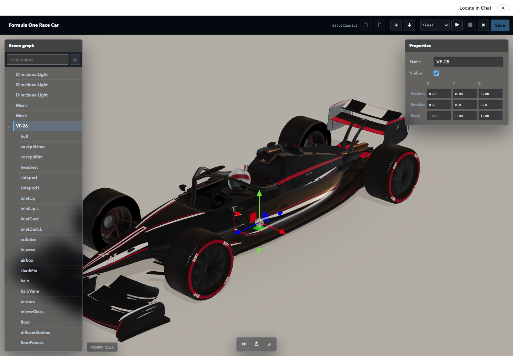
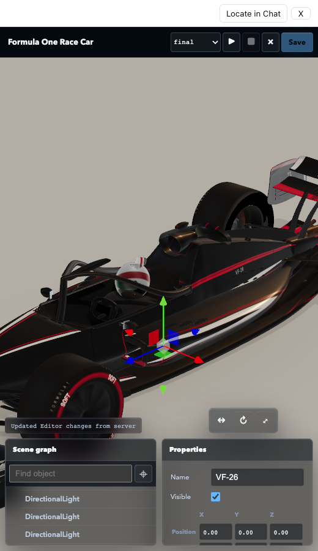
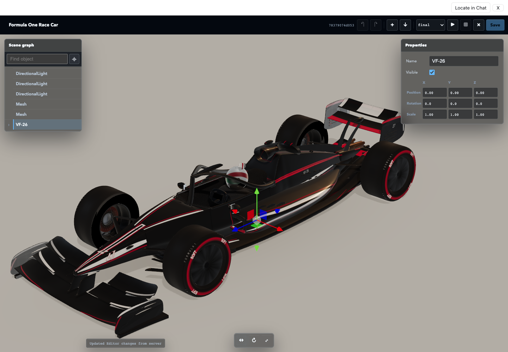

# M7 AI Undo Regression Validation

Status: **PASS, awaiting user approval**

## 结论

用户提供的真实 Session 中，AI 撤销命令本身正确：

```text
hull.position
[0, 0.8903357061400037, 0]
-> [0, 0, 0]

revision
5d1e660a... -> 99512c65...
```

目标 revision 的 Workspace、87 个 Runtime 对象、Editor scene catalog 和
WebGPU build 均有效，build 为 `ready` 且无 error。

黑屏来自 App 生命周期：AI 只修改 `threejs.editor.json`，Editor 却按源码变更
重新构建并重启完整 WebGPU Runtime。赛车场景重新创建约 37.6 万三角形时，
旧画面已被移除，用户返回 Editor 会先看到黑屏。

对象选择还有第二个独立原因：Runtime 原先只发射一条精确射线。细零件边缘
即使可见，射线也可能穿过它并命中后方无名舞台 `Mesh`。真实赛车场景中，
固定坐标 `(866, 160)` 修复前选中舞台，左侧 `6px` 才能命中 `rearWing`。

## 修复

- `pull_project` 向 App-only 调用返回结构化 `editorOperations`。
- 仅 `threejs.editor.json` 变化时，在当前 Runtime 原地重放 compact operations。
- 保留 iframe、renderer、相机、选择和 Runtime identity，只推进 revision。
- 源码、依赖、参数或其他文件变化仍使用原有 revision-bound rebuild。
- Transform toolbar 从画布顶部移到底部；窄屏时放在属性面板上方右侧。
- 点击选择使用约 `6px` 多射线容差；有名称的场景零件优先于无名舞台，
  同时保留重叠对象循环选择。

## Fresh Replay Browser

```text
top canvas pointer: reachable
edge tolerance selection: rearWing
Runtime identity across AI undo: preserved
pixels after AI undo: 7,853 / 9,000 lit; 1,150 colors
pixels after fullscreen return: 8,036 / 9,000 lit; 975 colors
renderer: WebGPUBackend
App errors: 0
```



At `520 x 900`, the visible top viewport hit target is the Runtime iframe and
the transform toolbar remains above the bottom property panels.



## Real DeepSeek

Fresh isolated Harness used `deepseek-official / deepseek-v4-flash`.
The credential file was referenced read-only; it was not copied or committed.

Actual model-visible tool sequence:

```text
list_projects
open_editor
inspect_project
apply_editor_commands
inspect_project
```

The model changed only:

```json
{
  "type": "set_position",
  "objectUuid": "e83aa167-dddf-4d2a-b81a-af51ab308a0c",
  "value": [0, 0, 0]
}
```

The real-model Browser run preserved Runtime identity and produced the same
non-black pixel evidence after undo and fullscreen return.



## Gates

```text
Three.js Editor r185 upstream files: 28 verified
TypeScript: PASS
Node tests: 5 / 5
dsh-mcp-apps tests: 7 / 7
npm package boundary: 10 files
packed install and executable MCP call: PASS
```

The Browser and packed-install commands exit nonzero only after their business
assertions complete because the TRAE sandbox denies Chrome/Google Updater and
pnpm temporary cleanup outside the workspace.

Machine-readable evidence:
[`M7-ai-undo-regression-trace.json`](M7-ai-undo-regression-trace.json)
