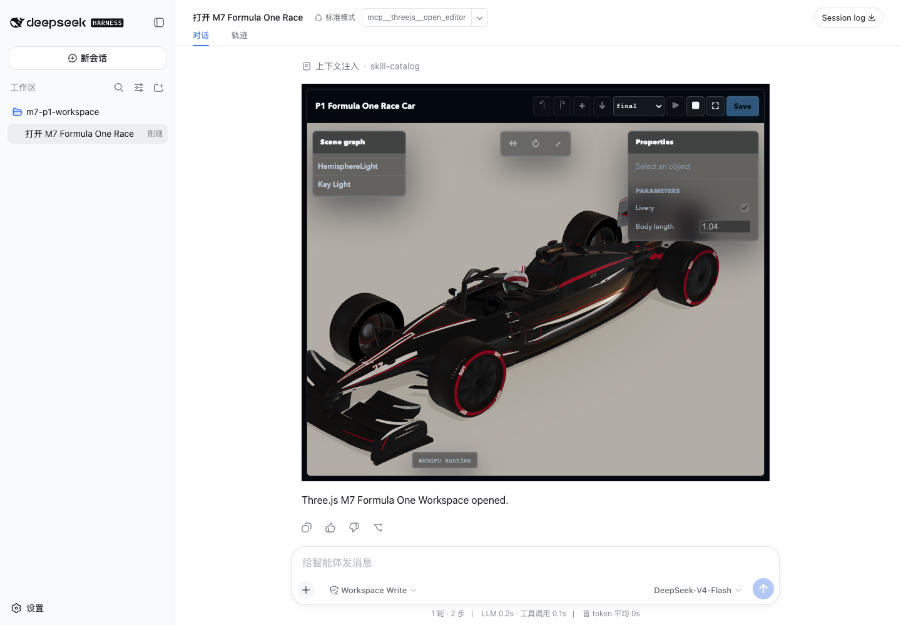
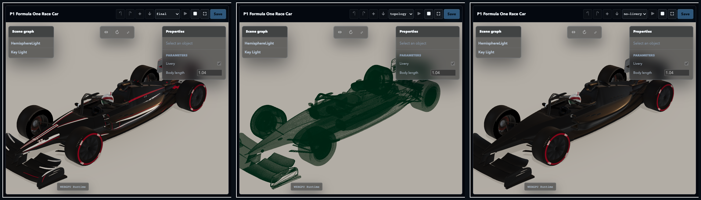
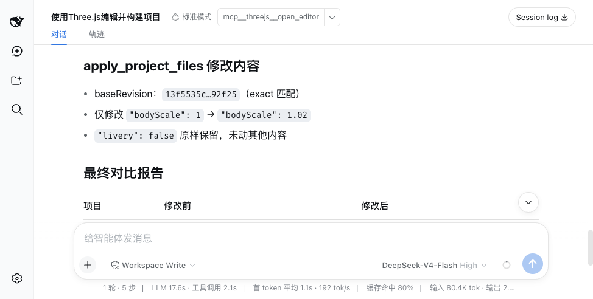

# M7 Validation Report

Date: 2026-08-19
Status: **PASS, awaiting user approval**

## 中文审阅摘要

M7 已完成 Module Builder、source map、复杂程序几何和 WebGPU Runtime
验收：

- 使用 esbuild VFS 构建 JS、TS、JSX、TSX、JSON、GLSL、WGSL 和 TSL；
- 固定支持 `three`、`three/webgpu`、`three/tsl` 和 `three/addons/*`；
- build 绑定 exact revision，并持久化 cache、external source map、结构化
  diagnostics 和 asset manifest；
- source map、metafile 和 diagnostics 不泄露本机绝对路径；
- Runtime 在第三层 opaque iframe 中自行创建并释放 WebGL/WebGPU renderer；
- P1 Formula One Race Car 通过真实 `WebGPUBackend` 呈现非空像素；
- Human 修改 livery，AI 在 exact revision 上修改 `bodyScale`，两个 revision
  均可重建；
- `final`、`topology`、`no-livery` 三种 debug mode 有独立视觉证据；
- Stop/Restart 后 renderer 仍为 1、没有停止后的消息、build cache ID 不变；
- fresh Harness 的真实 DeepSeek 模型只用 Three.js MCP tools 完成
  open/build/read/apply/build/check，并准确报告两个 build ID；
- 上游同步、类型检查、Node tests、packed install、Host 回归和 npm 内容审计通过。

M8 尚未开始。本报告获用户批准前不得进入 M8。

## Scope

M7 adds the first general browser module pipeline for Linked and Managed
Workspaces:

```text
immutable Workspace revision
-> esbuild virtual filesystem
-> revision-bound ESM bundle + external source map
-> threejs-build:// resource
-> opaque runtime iframe
-> WebGLRenderer or WebGPURenderer
```

It does not execute project npm scripts, install dependencies, load Vite
plugins, or evaluate project code on the Server.

## Results

| Gate | Evidence | Result |
|---|---|---|
| Builder formats | TypeScript, module imports, JSON, raw GLSL, Three.js WebGPU/TSL/addons | PASS |
| Exact revision | stale or unknown revision refused; cache key includes revision and dependency profile | PASS |
| Diagnostics | failed source maps to original file, line, and column; no failed bundle emitted | PASS |
| Source privacy | source map and bundle contain no `/Users/` path | PASS |
| Build resources | `bundle.js` and `bundle.js.map` read through dynamic MCP Resource URIs | PASS |
| P1 provenance | 9 files, 143,644 bytes, pinned corpus commit | PASS |
| P1 Server build | WebGPU, 15 inputs, 0 errors, 0 warnings | PASS |
| Real renderer | `rendererBackend=WebGPUBackend`, secure context and WebGPU API true | PASS |
| Non-empty pixels | 7,795/9,000 lit samples, 6,856 contrast samples, 1,107 colors | PASS |
| Human revision | App-only livery edit produced a new clean revision without an Agent turn | PASS |
| AI revision | exact-revision `bodyScale=1.04` transaction followed the Human revision | PASS |
| Geometry evidence | 62 parts, 375,964 unique triangles, 168 hull rings, 96 segments | PASS |
| Debug modes | final, topology, and no-livery screenshots correspond to rendered frames | PASS |
| Runtime disposal | Stop froze frame count; Restart retained one renderer and the cached build ID | PASS |
| Real LLM | fresh non-Replay DeepSeek run reported both revisions and both build IDs | PASS |
| Host regression | `dsh-mcp-apps` typecheck, build, and 7 tests | PASS |
| Package boundary | 10-file tarball excludes corpus, tests, reports, `.tmp`, assets, and credentials | PASS |

## Builder Contract

The builder accepts only files already present in the bounded Workspace
manifest. Browser dependency resolution is limited to:

```text
three
three/webgpu
three/tsl
three/addons/*
```

Other bare imports become structured build errors. The Server does not run
project code, lifecycle scripts, package installation, or framework plugins.

The build ID hashes:

```text
project ID
revision
entry
backend
builder version
dependency profile
```

Ready builds persist `build.json`, `bundle.js`, `bundle.js.map`, diagnostics,
inputs, and assets under `.threejs-editor/builds/<buildId>/`. Failed builds
persist metadata and diagnostics but no executable bundle.

Absolute paths are projected into stable logical names:

```text
workspace:///src/main.ts
dependency://three/build/three.webgpu.js
runtime://entry.js
```

`build_project` exposes `buildId` in structured content and model-visible text
for both ready and failed builds.

## P1 Provenance And Build

The test corpus is:

```text
Repository:
https://github.com/scottstts/Threejs-Awesome-Graphics-Agent-Skills

Commit:
98453747cc0678f6a5d910f38d7483596a5f9a40

Example:
threejs-procedural-geometry/formula-one-race-car
```

`scripts/prepare-m7-p1.mjs` verifies the commit before copying the nine required
source files into a gitignored Workspace. The external corpus is not part of
the npm package.

The final independent Server build returned:

```text
revision:       13f5535c663575b6de9184230407308e670aaf12db92267dfcd4357971592f25
buildId:        81a6166e79a0f78d4bd898b5e81edaaebb5522afdd5bc0737fff0728d2efde0a
backend:        webgpu
bundle bytes:   3,168,165
source map:     6,560,648
inputs:         15
errors:         0
warnings:       0
```

## Runtime And Collaboration

The runtime iframe remains:

```html
<iframe sandbox="allow-scripts">
```

Its origin is `null`; it has no AppBridge and receives the bundle through
`postMessage`. The runtime owns renderer, controls, animation frame, and Blob
URL disposal.

The deterministic Harness sequence was:

```text
open current DSH Workspace
-> Human toggles livery in Parameters
-> App-only apply_project_files
-> no Agent turn
-> same Harness MCP Host applies exact-revision bodyScale=1.04
-> App pulls the external revision
-> Play WebGPU runtime
-> final/topology/no-livery
-> Stop
-> Restart from cached build
-> Stop
```

The resulting Runtime metrics were:

```json
{
  "rendererCount": 1,
  "secureContext": true,
  "webgpuApi": true,
  "rendererBackend": "WebGPUBackend",
  "draws": 23,
  "triangles": 918211,
  "emittedParts": 62,
  "uniqueTriangles": 375964,
  "hullRings": 168,
  "hullSegments": 96,
  "livery": true,
  "bodyScale": 1.04
}
```

The full data is in
[`M7-runtime-trace.json`](M7-runtime-trace.json).





## Real LLM

A separate fresh Harness profile loaded no Replay adapter. The Session source
was `deepseek-official / deepseek-v4-flash`.

The model autonomously called:

```text
open_editor
-> build_project
-> read_project_files
-> apply_project_files
-> build_project
-> check_project
```

It changed only `src/parameters.json`, preserved `livery: false`, moved
`bodyScale` from `1` to `1.02`, and reported:

```text
base buildId:
b1817ed1d5e8ab3061b0b73fe6d35e57b363b18bd6956c928b57e11dc4aeab09

target buildId:
44c4541276d969618016be8922923f68b19177d578fd88d1a779042657c95eed

check:
0 errors, 0 warnings
```

No generic file write or shell tool was called. See
[`M7-real-llm-validation.md`](M7-real-llm-validation.md) and
[`M7-real-llm-trace.json`](M7-real-llm-trace.json).



## Verification

The following functional gates passed:

```sh
pnpm run check:upstream
pnpm run typecheck
pnpm run test
node scripts/prepare-m7-p1.mjs
node tests/m7-p1-build.mjs
pnpm run test:pack

cd ../dsh-mcp-apps
pnpm run check
```

Node test result:

```text
tests: 4
pass: 4
fail: 0
```

Host test result:

```text
tests: 7
pass: 7
fail: 0
```

`pnpm run release:check` completed all assertions, including packed
installation and executable MCP calls. Its outer command then exited nonzero
because the TRAE sandbox refused pnpm cleanup under
`~/Library/pnpm/_tmp_*`. This occurred after the packed-install result was
printed and is an environment cleanup artifact, not a failed package
assertion.

An independent `npm pack --dry-run --json --ignore-scripts` passed. The tarball
contains only:

```text
LICENSE
README.md
README.zh-CN.md
THIRD_PARTY_NOTICES.md
dist/server.js
dist/view.js
docs/COMPLEX-GAME-EDITOR-PLAN.md
docs/DESIGN.md
docs/USER-OPERATIONS.md
package.json
```

Final build artifacts:

```text
dist/server.js
175,772 bytes
SHA-256 a4542f352b17cc92c8690ba5d4fe03bbf739e61dbe207775e62a545febb449a2

dist/view.js
1,235,088 bytes
SHA-256 6ca4f8d722fca99d4c0fb8ba35de2d8a3feacc1856aad4e07094969deda3cb47
```

Credential-shaped value scanning found no API key or npm token in tracked or
pending source, tests, docs, and reports.

## Visual Evidence

| Artifact | SHA-256 |
|---|---|
| `m7-p1-final.png` | `75f41f547af916a1daa0282bbde412419c833bdeb0c872cd0292562157f0ebc4` |
| `m7-p1-topology.png` | `51c14c9676318407c208e5ea0653df003d06e35b755ce1dd0f6ec1e993f48907` |
| `m7-p1-no-livery.png` | `1b0cd450e27eec2282d5fdc149dac3d1cffc1647b654cffd49c1f7f7fd410d7f` |
| `m7-p1-debug-contact-sheet.png` | `5d100b7226b235a78977c4352cb593f9b72d84ef3683de6f0f3f7f5eaa196f26` |
| `m7-real-llm-build-id.png` | `93c60b49f057be8626cb03c187a308a5344ae17938a6316d807581f5a123837b` |

## Known Limits

- M7 supports the pinned browser dependency profile, not arbitrary npm
  packages or framework plugins.
- Assets are manifested but complex URL rewriting and arbitrary Vite plugin
  behavior are outside M7.
- Raw WebGPU without Three.js remains a later stretch case.
- Runtime input ownership, temporal render targets, and interactive multi-pass
  cases belong to M8.
- The user-facing UI remains Scene-only; source editing is through MCP tools.

## Approval Gate

M7 implementation and validation are complete. M8 Interactive Multi-Pass
WebGL remains blocked until the user explicitly approves this report.
