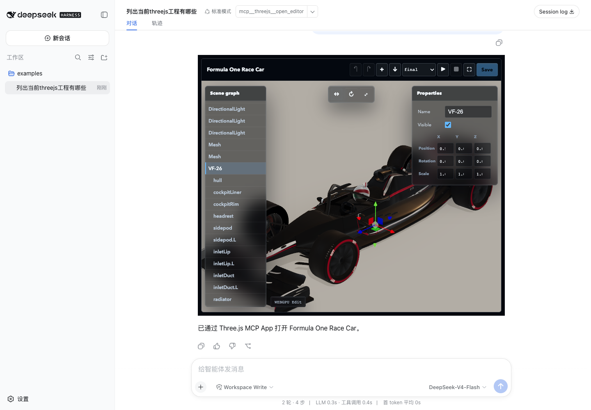
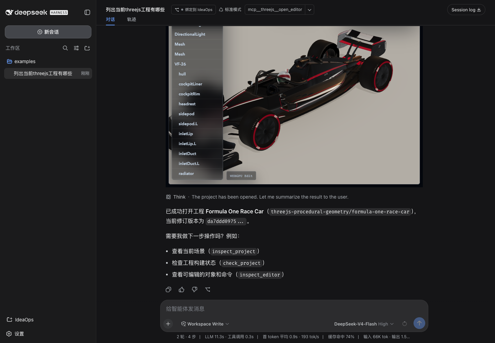

# M7 Validation Report

Date: 2026-08-19
Status: **PASS after edit-mode Runtime correction, awaiting renewed approval**

## 中文审阅摘要

M7 已完成 Module Builder、source map、复杂程序几何，以及可编辑 WebGPU
Runtime 验收。此前“只有 Play 后可见”的 Player 证据已作废：

- 使用 esbuild VFS 构建 JS、TS、JSX、TSX、JSON、GLSL、WGSL 和 TSL；
- 固定支持 `three`、`three/webgpu`、`three/tsl` 和 `three/addons/*`；
- build 绑定 exact revision，并持久化 cache、external source map、结构化
  diagnostics 和 asset manifest；
- source map、metafile 和 diagnostics 不泄露本机绝对路径；
- Runtime 在第三层 opaque iframe 中自行创建 WebGL/WebGPU renderer；
- Workspace 打开后无需 Play 即进入 `edit` mode，并呈现真实 Formula One
  Race Car；
- Scene graph、画布选择、Properties 和 TransformControls 操作 Runtime
  中的真实 `VF-26` 对象，不再只显示投影灯光；
- Human 将 `VF-26.position.x` 从 `0` 改为 `0.25` 并保存，AI 再通过同一
  UUID 和官方 Editor Command 改为 `0.5`；两个 revision 均可重建；
- Play 切换到 `run` mode，Stop 返回同一 `edit` mode，保留对象覆盖；
- Human 修改 livery，AI 在 exact revision 上修改 `bodyScale`，两个 revision
  均可重建；
- `final`、`topology`、`no-livery` 三种 debug mode 有独立视觉证据；
- Stop/Restart 后 renderer 仍为 1、没有停止后的消息、build cache ID 不变；
- fresh Harness 的真实 DeepSeek 模型只用 Three.js MCP tools 完成
  open/build/read/apply/build/check，并准确报告两个 build ID；
- 用户日志中的 `dev/example-gallery/examples` 目录可直接作为 DSH Workspace：
  `list_projects` 发现 37 个 corpus 案例，第一次 `open_editor({ projectPath })`
  即打开 Formula One Race Car MCP App；
- fresh 真实 DeepSeek Session 只调用 `list_projects` 和 `open_editor`，没有
  shell、npm、gallery server 或 HTML fallback；
- 固定 Gallery adapter 只读解析同一 corpus 中的 `dev/` 与 `skills/` closure，
  source corpus 保持 clean，编辑仍隔离在 Managed Workspace；
- 上游同步、类型检查、Node tests、packed install、Host 回归和 npm 内容审计通过。

M8 尚未开始。本报告获用户批准前不得进入 M8。

## Scope

M7 adds the first general browser module pipeline for Linked and Managed
Workspaces:

```text
immutable Workspace revision
-> esbuild virtual filesystem
-> revision-bound ESM bundle + external source map
-> threejs-build:// resource
-> opaque runtime iframe
-> WebGLRenderer or WebGPURenderer
```

It does not execute project npm scripts, install dependencies, load Vite
plugins, or evaluate project code on the Server.

For multi-project example repositories, M7 now adds:

```text
DSH dev/example-gallery/examples Workspace
-> list_projects discovers relative example.json candidates
-> open_editor({ projectPath })
-> fixed Gallery adapter reads bounded /dev + /skills closure
-> source-revision-bound Managed Workspace
-> MCP App
```

The model receives only a relative `projectPath` and opaque `example-*`
project ID. The source repository is not modified.

## Results

| Gate | Evidence | Result |
|---|---|---|
| Builder formats | TypeScript, module imports, JSON, raw GLSL, Three.js WebGPU/TSL/addons | PASS |
| Exact revision | stale or unknown revision refused; cache key includes revision and dependency profile | PASS |
| Diagnostics | failed source maps to original file, line, and column; no failed bundle emitted | PASS |
| Source privacy | source map and bundle contain no `/Users/` path | PASS |
| Build resources | `bundle.js` and `bundle.js.map` read through dynamic MCP Resource URIs | PASS |
| P1 provenance | 9 files, 143,644 bytes, pinned corpus commit | PASS |
| P1 Server build | WebGPU, 16 inputs, 0 errors, 0 warnings | PASS |
| Real renderer | `rendererBackend=WebGPUBackend`, secure context and WebGPU API true | PASS |
| Non-empty pixels | 7,795/9,000 lit samples, 6,856 contrast samples, 1,107 colors | PASS |
| Edit without Play | Gallery edit mode: 7,847/9,000 lit samples, 6,944 contrast samples, 1,133 colors | PASS |
| Real Scene graph | `VF-26`, `hull`, and generated child objects are selectable before Play | PASS |
| Human revision | App-only livery edit produced a new clean revision without an Agent turn | PASS |
| AI revision | exact-revision `bodyScale=1.04` transaction followed the Human revision | PASS |
| Runtime object revision | Human `VF-26.x=0.25`; AI continued with the same UUID at `x=0.5` | PASS |
| Geometry evidence | 62 parts, 375,964 unique triangles, 168 hull rings, 96 segments | PASS |
| Debug modes | final, topology, and no-livery screenshots correspond to rendered frames | PASS |
| Edit/run lifecycle | Play enters run; Stop returns to edit with one renderer and the cached build ID | PASS |
| Real LLM | fresh non-Replay DeepSeek run reported both revisions and both build IDs | PASS |
| Workspace discovery | `examples` Workspace returns 37 relative candidates: 33 ready, 4 restricted | PASS |
| Direct MCP App open | Natural-language request mounts a non-black editable App without Play | PASS |
| Gallery corpus adapter | Fixed layout maps only `dev/` and `skills/`; unrelated parent files remain inaccessible | PASS |
| Gallery build | Managed Workspace builds WebGPU with 17 inputs and 0 diagnostics | PASS |
| Host regression | `dsh-uni-editor` typecheck, build, and 7 tests | PASS |
| Package boundary | 10-file tarball excludes corpus, tests, reports, `.tmp`, assets, and credentials | PASS |

## Builder Contract

The builder accepts only files already present in the bounded Workspace
manifest. Browser dependency resolution is limited to:

```text
three
three/webgpu
three/tsl
three/addons/*
```

Other bare imports become structured build errors. The Server does not run
project code, lifecycle scripts, package installation, or framework plugins.

The build ID hashes:

```text
project ID
revision
entry
backend
builder version
dependency profile
```

Ready builds persist `build.json`, `bundle.js`, `bundle.js.map`, diagnostics,
inputs, and assets under `.threejs-editor/builds/<buildId>/`. Failed builds
persist metadata and diagnostics but no executable bundle.

Absolute paths are projected into stable logical names:

```text
workspace:///src/main.ts
dependency://three/build/three.webgpu.js
runtime://entry.js
```

`build_project` exposes `buildId` in structured content and model-visible text
for both ready and failed builds.

## P1 Provenance And Build

The test corpus is:

```text
Repository:
https://github.com/scottstts/Threejs-Awesome-Graphics-Agent-Skills

Commit:
98453747cc0678f6a5d910f38d7483596a5f9a40

Example:
threejs-procedural-geometry/formula-one-race-car
```

`scripts/prepare-m7-p1.mjs` verifies the commit before copying the nine required
source files into a gitignored Workspace. The external corpus is not part of
the npm package.

The second user-path correction validates P1 from the same nested Workspace
used in the rejected user Session:

```text
dev/example-gallery/examples
```

`list_projects` discovers all 37 `example.json` manifests without hashing
unrelated assets. Its machine result reports 33 ready and 4 restricted by
dependencies outside the M7 profile. The fixed Gallery adapter maps imports
under `/dev` and `/skills` to the same pinned corpus, copies only the static
closure into the configured Managed Workspace root, and opens the Editor App.
It rejects other parent paths and does not execute the corpus gallery, npm, or
HTML runtime.

The final independent Server build returned:

```text
revision:       da7ddd097581425e27b2a52892fba9c5c0a3666321302e5d43c4842a806c07f2
buildId:        b634f0c23459f2fe92347072247f52091eaa591a80ae863771443309edb505a1
backend:        webgpu
bundle bytes:   3,213,537
source map:     6,651,680
inputs:         17
errors:         0
warnings:       0
```

## Runtime And Collaboration

The runtime iframe remains:

```html
<iframe sandbox="allow-scripts">
```

Its origin is `null`; it has no AppBridge and receives the bundle through
`postMessage`. The runtime owns renderer, controls, animation frame, and Blob
URL disposal. It now has two explicit modes:

```text
open exact revision
-> edit: real scene rendered, simulation update paused
-> run: simulation update enabled
-> stop
-> edit: same renderer, scene overrides, and object identity
```

The Runtime reports a bounded editable object catalog with deterministic UUIDs
derived from scene paths. The App mirrors that catalog into the pinned r185
Editor command model. Selection, Properties, and TransformControls operate on
the Runtime object; only official command operations are persisted.

Workspace edits are compacted into revision-managed `threejs.editor.json`.
The source corpus remains read-only. The Runtime object catalog for an exact
revision is stored under `.threejs-editor/editor-scenes/` for model-side
`inspect_editor`.

The Gallery collaboration sequence was:

```text
open_editor({ projectPath })
-> edit mode renders VF-26 without Play
-> Human selects VF-26 and sets position.x = 0.25
-> App-only apply_editor_commands + new revision
-> AI inspect_editor sees the same UUID
-> AI apply_editor_commands sets position.x = 0.5
-> App pulls the revision and remains in edit mode
-> Play enters run mode
-> Stop returns to edit mode with position.x = 0.5
```

Gallery edit-mode pixel evidence:

```json
{
  "rendererBackend": "WebGPUBackend",
  "sampled": 9000,
  "lit": 7847,
  "contrast": 6944,
  "colors": 1133,
  "editorObject": "VF-26"
}
```

The complete Human/AI object edit and Play/Stop data is in
[`M7-gallery-edit-trace.json`](M7-gallery-edit-trace.json).

The deterministic Harness sequence was:

```text
open current DSH Workspace
-> Human toggles livery in Parameters
-> App-only apply_project_files
-> no Agent turn
-> same Harness MCP Host applies exact-revision bodyScale=1.04
-> App pulls the external revision
-> edit-mode WebGPU scene is already visible
-> Play switches the same scene to run mode
-> final/topology/no-livery
-> Stop returns to edit mode
-> Restart from cached build
-> Stop returns to edit mode
```

The resulting Runtime metrics were:

```json
{
  "rendererCount": 1,
  "secureContext": true,
  "webgpuApi": true,
  "rendererBackend": "WebGPUBackend",
  "draws": 23,
  "triangles": 918211,
  "emittedParts": 62,
  "uniqueTriangles": 375964,
  "hullRings": 168,
  "hullSegments": 96,
  "livery": true,
  "bodyScale": 1.04
}
```

The full data is in
[`M7-runtime-trace.json`](M7-runtime-trace.json).


## Real LLM

A separate fresh Harness profile loaded no Replay adapter. The Session source
was `deepseek-official / deepseek-v4-flash`.

The model autonomously called:

```text
open_editor
-> build_project
-> read_project_files
-> apply_project_files
-> build_project
-> check_project
```

It changed only `src/parameters.json`, preserved `livery: false`, moved
`bodyScale` from `1` to `1.02`, and reported:

```text
base buildId:
b1817ed1d5e8ab3061b0b73fe6d35e57b363b18bd6956c928b57e11dc4aeab09

target buildId:
44c4541276d969618016be8922923f68b19177d578fd88d1a779042657c95eed

check:
0 errors, 0 warnings
```

No generic file write or shell tool was called. See
[`M7-real-llm-validation.md`](M7-real-llm-validation.md) and
[`M7-real-llm-trace.json`](M7-real-llm-trace.json). The separate user-path
regression is in
[`M7-gallery-real-llm-trace.json`](M7-gallery-real-llm-trace.json).






## Verification

The following functional gates passed:

```sh
pnpm run check:upstream
pnpm run typecheck
pnpm run test
node scripts/prepare-m7-p1.mjs
node tests/m7-p1-build.mjs
pnpm run test:pack

cd ../dsh-uni-editor
pnpm run check
```

Node test result:

```text
tests: 5
pass: 5
fail: 0
```

Host test result:

```text
tests: 7
pass: 7
fail: 0
```

`pnpm run release:check` completed all assertions, including packed
installation and executable MCP calls. Its outer command then exited nonzero
because the TRAE sandbox refused pnpm cleanup under
`~/Library/pnpm/_tmp_*`. This occurred after the packed-install result was
printed and is an environment cleanup artifact, not a failed package
assertion.

An independent `npm pack --dry-run --json --ignore-scripts` passed. The tarball
contains only:

```text
LICENSE
README.md
README.zh-CN.md
THIRD_PARTY_NOTICES.md
dist/server.js
dist/view.js
docs/COMPLEX-GAME-EDITOR-PLAN.md
docs/DESIGN.md
docs/USER-OPERATIONS.md
package.json
```

Final build artifacts:

```text
dist/server.js
197,522 bytes
SHA-256 4777641174f8157634b9c65d73371043f1dabac41f3510242c104f76fbcd9d1a

dist/view.js
1,250,857 bytes
SHA-256 d01de1f72e766715254e945c8d0c9e3880f42d68b5042ac4192327c0b63455f8
```

Credential-shaped value scanning found no API key or npm token in tracked or
pending source, tests, docs, and reports.

## Visual Evidence

| Artifact | SHA-256 |
|---|---|
| `m7-p1-final.png` | `fb4d22cb751575a93508f4227d7e793432546f3ab72f25dec7da8814ff8f1d2c` |
| `m7-p1-topology.png` | `51c14c9676318407c208e5ea0653df003d06e35b755ce1dd0f6ec1e993f48907` |
| `m7-p1-no-livery.png` | `1b0cd450e27eec2282d5fdc149dac3d1cffc1647b654cffd49c1f7f7fd410d7f` |
| `m7-p1-debug-contact-sheet.png` | `5d100b7226b235a78977c4352cb593f9b72d84ef3683de6f0f3f7f5eaa196f26` |
| `m7-real-llm-build-id.png` | `93c60b49f057be8626cb03c187a308a5344ae17938a6316d807581f5a123837b` |
| `m7-gallery-direct-open.png` | `9ea57fc5e8d773d89329c78aafe2b8cceeabf17bb594ab04571d234e23aacd2d` |
| `m7-gallery-real-direct-open.png` | `ea6d769f40b2493a8a49909fc50dddf4c30ed371fc35d9d607714d4ce93d56ba` |

## Known Limits

- M7 supports the pinned browser dependency profile, not arbitrary npm
  packages or framework plugins.
- Assets are manifested but complex URL rewriting and arbitrary Vite plugin
  behavior are outside M7.
- Multi-project discovery currently targets the corpus `example.json` +
  `scene.js` convention. Generic npm/pnpm monorepo package discovery is not
  implied.
- The parent mapping is specific to the pinned Gallery
  `dev/example-gallery/examples` layout and permits only `dev/` and `skills/`;
  it is not generic parent traversal.
- Gallery examples open as source-revision-bound Managed Workspaces. Edits
  apply to that projection; the source corpus remains unchanged.
- Visual editing covers stable Runtime objects and supported transform,
  visibility, name, and material-color properties. Shader internals, GPU
  buffers, and procedural generator source remain file/parameter editing
  surfaces.
- Raw WebGPU without Three.js remains a later stretch case.
- Runtime input ownership, temporal render targets, and interactive multi-pass
  cases belong to M8.
- The user-facing UI remains Scene-only; source editing is through MCP tools.

## Approval Gate

M7 implementation and the second user-path correction are complete. M8
Interactive Multi-Pass WebGL remains blocked until the user explicitly
re-approves this report.
